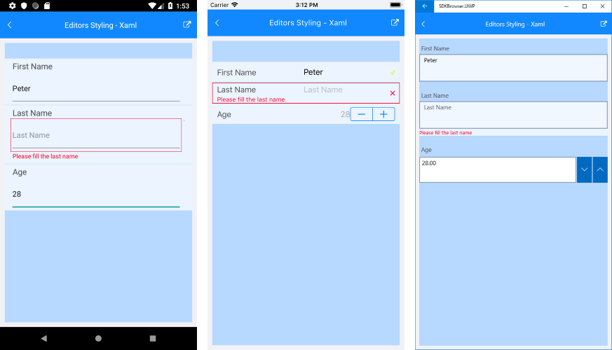

# Editors Styling

RadDataForm editors appearance can be customized with the **EditorStyle** property of type *DataFormEditorStyle*. The DataFormEditorStyle exposes the following properties:

- **Height**: Sets the height of each editor.
- **Background**: Specifies the background color of the editors.
- **HeaderForeground**: Defines the foreground color of the editors header.
- **HeaderFontSize**: Specifies the font size of the editors header.

The properties below are related to the look &amp;feel of the positive and negative feedback messages related to validating the input fields:

- **FeedbackFontSize**;
- **FeedbackImageSize**;
- **PositiveFeedbackForeground**;
- **NegativeFeedbackForeground**;
- **PositiveFeedbackBackground**;
- **NegativeFeedbackBackground**;
- **PositiveFeedbackImage** (of type *ImageSource*);
- **NegativeFeedbackImage** (of type *ImageSource*);

## Example

<snippet id='dataform-styling-editors-xaml'/>
<snippet id='dataform-styling-editors'/>

and add the following namespace:

<snippet id='xmlns-telerikdataform'/>

Result:

>important Sample examples demonstrating editors styling of DataForm control can be found inside the RadDataForm -> Styling section within the [SDK Samples Browser application]().

## See Also

- [Editors]()
- [Validate and Commit]()