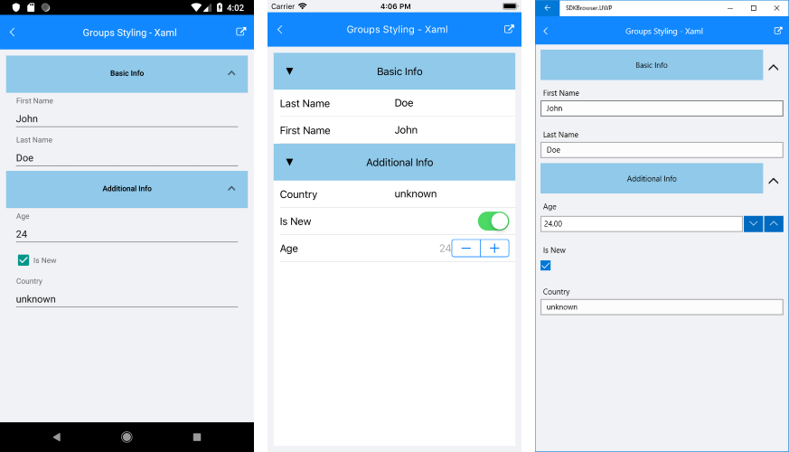

# Groups Styling

The RadDataForm group headers appearance can be customized with the **GroupHeaderStyle** property of type *DataFormGroupHeaderStyle*.

The **DataFormGroupHeaderStyle** class exposes the following properties:  

- **Background**: Specifies the background of the group headers.
- **BackgroundImageSource** (ImageSource): Sets a background image for the group header.
- **Foreground**: Determines the group header text color.
- **Height**: Specifies the group header height.
- **IsCollapsible**: Indicates whether the group will be collapsible.
- **Padding**: Sets the group header content padding.
- **TextAlignment**: Specifies the group header text alignment.

## Example

Here is an example that demonstrates how to style the data form group headers.

<snippet id='dataform-styling-groups-xaml'/>
<snippet id='dataform-styling-groups-csharp'/>

Don't forget to add the following namespaces:

<snippet id='xmlns-telerikdataform'/>
<snippet id='ns-telerikdataform'/>

Here is the source item class:

<snippet id='dataform-styling-groups-dataitem'/>

And this is how the DataForm Group Styling looks:

>important Sample examples demonstrating groups styling of DataForm control can be found inside the RadDataForm -> Styling section within the [SDK Samples Browser application]().

## See Also

- [Editors]()
- [Group Layouts]()