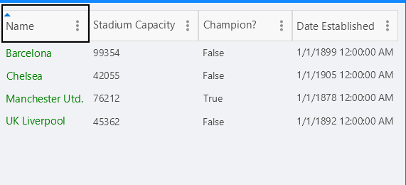
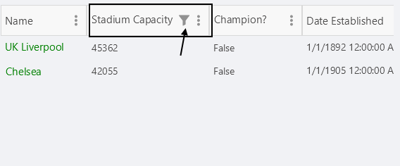

# Column Headers

This article will guide you through the usage of the column headers, their customization as well through performing different data operations. Column headers are always visible and cannot be hidden.


## Changing the text in the header

To customize text inside the header you have to use the `HeaderText` property. The property is per column. If `HeaderText` is not set, the text inside the `PropertyName` is displayed.

```XAML
<telerikDataGrid:RadDataGrid x:Name="dataGrid" 
					         AutoGenerateColumns="False">
	<telerikDataGrid:RadDataGrid.Columns>
		<telerikDataGrid:DataGridTextColumn PropertyName="Capital" 
									HeaderText="Capital Header"/>
		<telerikDataGrid:DataGridTextColumn PropertyName="Country" 
									HeaderText="Country Header"/>
	</telerikDataGrid:RadDataGrid.Columns>
</telerikDataGrid:RadDataGrid>
```

## Sorting

You can easily sort a particular column tapping ot its header. When the data is sorted by a column, its header changes its appearance and shows the sort direction via an indicator.



To learn more about the sorting functionality take a look at the [Sorting]() article.

## Filtering

The header of the column hosts the built-in filtering mechanism (the filter indicator which opens the Filtering UI), which allows you to filter the data by the columns' values.



To learn more about the filtering functionality take a look at the [Filtering]() article.

## Styling 

Use the `HeaderStyle` property in order to style the DataGridColumn header.

Check the [Xamarin DataGrid Column Header Styling](#headerstyle) topic for more information about the styling options you can use. 

## Header Content Customization

You can easily customize the content of the Header using the `HeaderContentTemplate`(`DataTemplate`) property.

## See Also

- [Text Column]()
- [Picker Column]()
- [Template Column]()