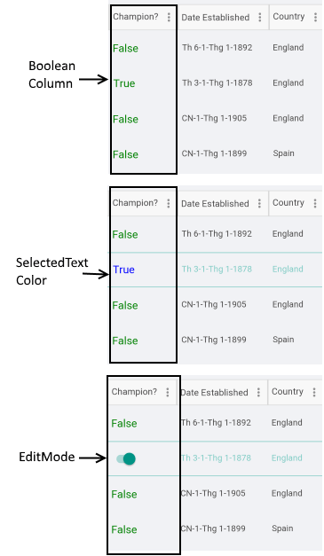

# DataGrid BooleanColumn

The **DataGridBooleanColumn** is used to represent boolean values. It uses Switch control to edit its values in EditMode.

## Important Properties

* **PropertyName**: Specifies the name of the property of the object type that represents each row within the grid.
* **HeaderText**: Defines the content to be displayed in the Header UI that represents the column.
* **CellContentStyle**: Defines the Style object that defines the appearance of each cell associated with this column. The TargetType of the Style should be TextBlock type.
* **CellContentStyleSelector**: Defines the StyleSelector instance that allows for dynamic appearance on a per cell basis.
* **CellContentFormat**: Defines the custom format for each cell value. The String.Format routine is used and the format passed should be in the form required by this method.

>tip More information about **CellDecorationStyle** and  **CellDecorationStyleSelector** can be found in [Columns Styling]() topic.

>important **CellContentFormat** uses the format string provided by the framework. For more details check the [String.Format](https://docs.microsoft.com/en-us/dotnet/api/system.string.format?view=netframework-4.8) article.

## Example

```XAML
<telerikGrid:DataGridBooleanColumn PropertyName="IsChampion" 
                                    HeaderText="Champion?">
    <telerikGrid:DataGridBooleanColumn.CellContentStyle>
        <telerikGrid:DataGridTextCellStyle TextColor="Green" 
                                            FontSize="18" 
                                            SelectedTextColor="Blue" />
    </telerikGrid:DataGridBooleanColumn.CellContentStyle>
</telerikGrid:DataGridBooleanColumn>
```



## See Also

- [Columns Styling]()
- [Text Column]()
- [Numerical Column]()
