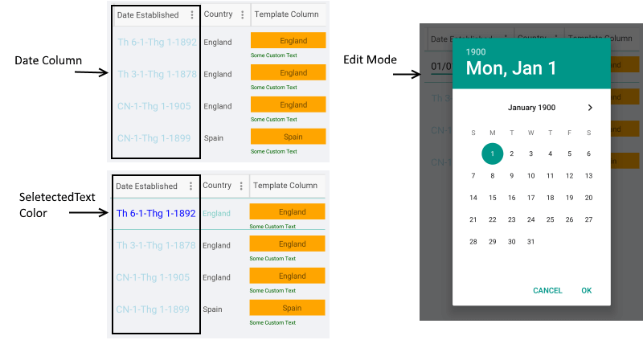

# DataGrid DateColumn

The **DataGridDateColumn** is used to represent **DateTime** objects. It uses the **DatePicker** control to pick a value in EditMode.

## Important Properties

* **PropertyName**: Specifies the name of the property of the object type that represents each row within the grid.
* **HeaderText**: Defines the content to be displayed in the Header UI that represents the column.
* **CellContentStyle**: Defines the Style object that defines the appearance of each cell associated with this column. The TargetType of the Style should be TextBlock type.
* **CellContentStyleSelector**: Defines the StyleSelector instance that allows for dynamic appearance on a per cell basis.
* **CellContentFormat**: Specifies the custom format for each cell value. The String.Format routine is used and the format passed should be in the form required by this method.

>tip More information about **CellDecorationStyle** and  **CellDecorationStyleSelector** can be found in [Columns Styling]() topic.

>important **CellContentFormat** uses the format string provided by the framework. For more details check the [Standard Date and Time Formatting](https://docs.microsoft.com/en-us/dotnet/standard/base-types/standard-date-and-time-format-strings) and [Custom Date and Time Formatting](https://docs.microsoft.com/en-us/dotnet/standard/base-types/custom-date-and-time-format-strings) articles.

## Example

```XAML
<telerikGrid:DataGridDateColumn PropertyName="Established" 
                                HeaderText="Date Established"
                                CellContentFormat="{}{0: ddd-d-MMM-yyyy}">
    <telerikGrid:DataGridDateColumn.CellContentStyle>
        <telerikGrid:DataGridTextCellStyle TextColor="LightBlue" 
                                           FontSize="18" 
                                           SelectedTextColor="Blue" />
    </telerikGrid:DataGridDateColumn.CellContentStyle>
</telerikGrid:DataGridDateColumn>
```



## See Also

- [Columns Styling]()
- [Text Column]()
- [Time Column]()