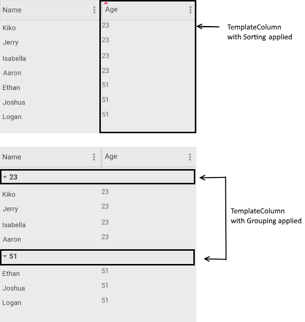

# DataGrid TemplateColumn

If you want to completely customize the content of the cells in a grid column you can use **DataGridTemplateColumn**, which uses a **DataTemplate** to describe the content of each associated grid cell.

## Important Properties:

* **HeaderText**: Defines the content to be displayed in the Header UI that represents the column.
* **SortDescriptor** (*SortDescriptorBase*)
* **GroupDescriptor** (*GroupDescriptorBase*)
* **CellContentTemplate** (DataTemplate): Defines the DataTemplate instance that defines the appearance of each cell associated with this column.
* **CellContentTemplateSelector** (DataTemplateSelector): Defines a DataTemplateSelector instance that may be used to retrieve dynamic data templates on a per cell basis.
* **CellEditTemplate** (DataTemplate): Defines the editor associated with the concrete column. The CellEditTemplate is displayed when the cell is in edit mode.
* **FilterControlTemplate**(DataTemplate): Specifies the user defined template used for Filtering UI. The template must contain an instance of the Telerik.XamarinForms.DataGrid.DataGridFilterControlBase class

>important More information about Sorting and Grouping can be found in [DataGrid Soting]() and [DataGrid Grouping]() articles.

>important **CellContentTemplate**, **CellEditTemplate** and **FilterControlTemplate** properties are part of the DataGrid features from R2 2020 Official Release. For more details on celledit and cell content templates features check the [Cell Templates]()article. For more details on filtercontrol template please review the [FilterControl Template](#filtercontrol-template) section.

## Sorting and Grouping for Template Column

The example below shows how Sorting and Grouping can be applied to the DataGrid Template Column. 

Here is how the VieWModel and the business object are defined:

```C#
public class ViewModel
{
    public ViewModel()
    {
        var source = new ObservableCollection<Person>();
        source.Add(new Person() { Name = "Kiko", Age = 23 });
        source.Add(new Person() { Name = "Jerry", Age = 23 });
        source.Add(new Person() { Name = "Ethan", Age = 51 });
        source.Add(new Person() { Name = "Isabella", Age = 23 });
        source.Add(new Person() { Name = "Joshua", Age = 51 });
        source.Add(new Person() { Name = "Logan", Age = 51 });
        source.Add(new Person() { Name = "Aaron", Age = 23 });

        this.Data = source;
    }

    public ObservableCollection<Person> Data { get; set; }
}

public class Person
{
    public string Name { get; set; }
    public int Age { get; set; }
}
```

The DataGrid definition:

```XAML
<telerikDataGrid:RadDataGrid AutoGenerateColumns="False"
                             ItemsSource="{Binding Data}" 
                             UserSortMode="Multiple">
    <telerikDataGrid:RadDataGrid.BindingContext>
        <local:ViewModel/>
    </telerikDataGrid:RadDataGrid.BindingContext>
    <telerikDataGrid:RadDataGrid.Columns>
		<telerikDataGrid:DataGridTextColumn PropertyName="Name"
	                                        HeaderText="Name"
	                                        CanUserSort="True"/>
        <telerikDataGrid:DataGridTemplateColumn HeaderText="Age"
                                                CanUserSort="True">
            <telerikDataGrid:DataGridTemplateColumn.CellContentTemplate>
                <DataTemplate>
                    <Label Text="{Binding Age}" />
                </DataTemplate>
            </telerikDataGrid:DataGridTemplateColumn.CellContentTemplate>

            <!-- Tell the DataGrid to sort using Age property with a SortDescriptor -->
            <telerikDataGrid:DataGridTemplateColumn.SortDescriptor>
                <telerikCommon:PropertySortDescriptor PropertyName="Age" />
            </telerikDataGrid:DataGridTemplateColumn.SortDescriptor>

            <!-- Tell the DataGrid to group using Age property with a GroupDescriptor -->
            <telerikDataGrid:DataGridTemplateColumn.GroupDescriptor>
                <telerikCommon:PropertyGroupDescriptor PropertyName="Age" />
            </telerikDataGrid:DataGridTemplateColumn.GroupDescriptor>
        </telerikDataGrid:DataGridTemplateColumn>
    </telerikDataGrid:RadDataGrid.Columns>
</telerikDataGrid:RadDataGrid>
```



## See Also

- [Columns Styling]()
- [Boolean Column]()
- [Date Column]()
