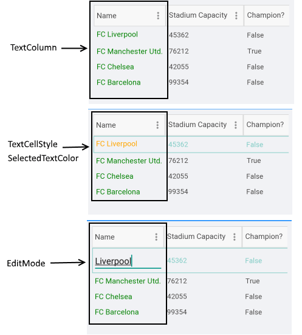

# DataGrid TextColumn

A DataGridTextColumn converts the content of each associated cell to a System.String object.

>note A DataGridTextColumn has better performance than a DataGridTemplateColumn.

## Important Properties

Here are the specific properties for TextColumns:

* **PropertyName**: Specifies the name of the property of the object type that represents each row within the grid.
* **HeaderText**: Defines the content to be displayed in the Header UI that represents the column.
* **CellContentFormat**: Defines the custom format for each cell value. The String.Format routine is used and the format passed should be in the form required by this method.
* **CellContentStyle**: Defines the Style object that defines the appearance of each cell associated with this column.
* **CellContentStyleSelector**: Defines the StyleSelector instance that allows for dynamic appearance on a per cell basis.
* **CellContentTemplate** (DataTemplate): Defines the appearance of each cell associated with the concrete column. CellContenTemplate gives you the opportunity to wrap the text inside each datagrid column. You can add a Label as a content of the Text, Template Column and wrap its text using the Label's **LineBreakMode** property.
* **CellEditTemplate** (DataTemplate): Defines the editor associated with the concrete column. The CellEditTemplate is displayed when the cell is in edit mode.
* **FilterControlTemplate**(DataTemplate): Specifies the user defined template used for Filtering UI. The template must contain an instance of the Telerik.XamarinForms.DataGrid.DataGridFilterControlBase class

>tip More information about **CellDecorationStyle** and  **CellDecorationStyleSelector** can be found in [Columns Styling]() topic.

>important **CellContentTemplate**, **CellEditTemplate** and **FilterControlTemplate** properties are part of the DataGrid features from R2 2020 Official Release. For more details on celledit and cell content templates features check the [Cell Templates]()article. For more details on filtercontrol template please review the [FilterControl Template](#filtercontrol-template) section.

>important **CellContentFormat** uses the format string provided by the framework. For more details check the [String.Format](https://docs.microsoft.com/en-us/dotnet/api/system.string.format?view=netframework-4.8) article.

## Example

Here is an example how the Text Column properties can be used: 

```XAML
<telerikGrid:DataGridTextColumn PropertyName="Name"
                                HeaderText="Name"
								CellContentFormat="FC {0}">
	<telerikGrid:DataGridTextColumn.CellContentStyle>
    	<telerikGrid:DataGridTextCellStyle TextColor="Green" 
                                           FontSize="15" 
                                           SelectedTextColor="Orange"  />
 	</telerikGrid:DataGridTextColumn.CellContentStyle>
 </telerikGrid:DataGridTextColumn>
```



## See Also

- [Columns Styling]()
- [Numerical Column]()
- [Boolean Column]()
