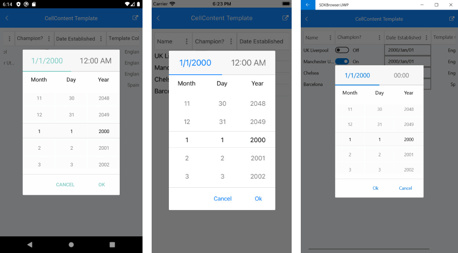
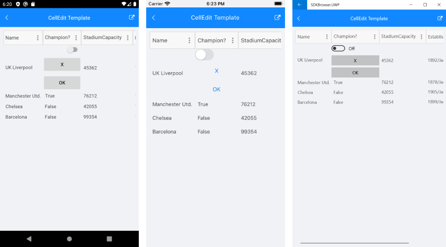

# Columns Cell Templates

This article describes how to set the content and edit templates to the DataGrid column using the **CellContentTemplate** and **CellEditTemplate** properties.

* **CellContentTemplate** (DataTemplate): Defines the appearance of each cell associated with the concrete column. CellContenTemplate gives you the opportunity to wrap the text inside each datagrid column. You can add a Label as a content of the Text, Template Column and wrap its text using the Label's **LineBreakMode** property.
* **CellEditTemplate** (DataTemplate): Defines the editor associated with the concrete column. The CellEditTemplate is displayed when the cell is in edit mode.

>important **CellContentTemplate** and **CellEditTemplate** properties are part of the DataGrid features from R2 2020 Official Release. 

## Cell Content Template Example

Use the following snippet to declare a RadDataGrid in XAML: 

<snippet id='datagrid-columns-cellcontenttemplate-xaml'/>

And add the following namespaces:

```xml
xmlns:telerikGrid="clr-namespace:Telerik.XamarinForms.DataGrid;assembly=Telerik.XamarinForms.DataGrid"
xmlns:telerikInput="clr-namespace:Telerik.XamarinForms.Input;assembly=Telerik.XamarinForms.Input"
```

The **ViewModel** class is declared as following:

<snippet id='datagrid-columns-viewmodel'/>
	
And the **Club** custom object:

<snippet id='datagrid-columns-data'/>

DataGrid Date Column with CellContentTemplate property and inside the template we have added a DateTime Picker control



>important An example with DataGrid CellContentTemplate can be found in the DataGrid/Columns folder of the [SDK Samples Browser application]().

## Cell Edit Template Example

Use the following snippet to declare a RadDataGrid in XAML: 

<snippet id='datagrid-columns-celledittemplate-xaml'/>

And add the following namespaces

```xml
xmlns:telerikGrid="clr-namespace:Telerik.XamarinForms.DataGrid;assembly=Telerik.XamarinForms.DataGrid"
xmlns:telerikInput="clr-namespace:Telerik.XamarinForms.Input;assembly=Telerik.XamarinForms.Input"
```

The **ViewModel** class is declared as following:

<snippet id='datagrid-columns-viewmodel'/>
	
And the **Club** custom object:

<snippet id='datagrid-columns-data'/>

DataGrid Boolean Column with CellEditTemplate property and inside the template we have added a switch, and two buttons. The edit template is visualized when the cell is in edit mode.



>important A sample example with DataGrid CellEditTemplate can be found in the DataGrid/Columns folder of the [SDK Samples Browser application]().

## See Also

- [Picker Column]()
- [Template Column]()
- [Text Column]()
