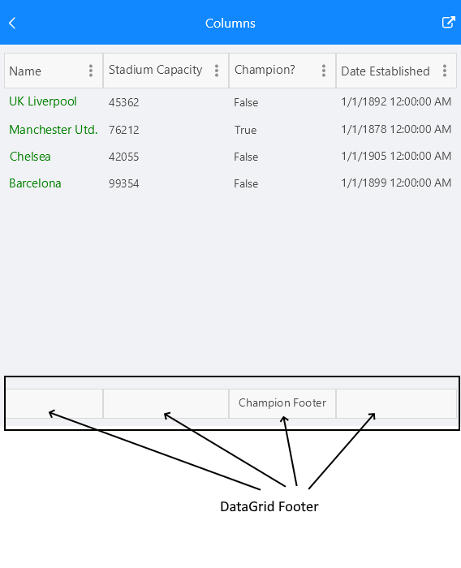

# Column Footers

The DataGrid allows you to display additional information which applies to the columns in a specific row placed at the bottom of the control. This row consists of individual footer cells for each column.



By default, column footers are hidden and in order to make them visible you have to set the `ShowColumnFooters` property to True.

The following example shows how to define a footer in the DataGrid:

```XAML
<telerikDataGrid:RadDataGrid x:Name="dataGrid" 
                             ShowColumnFooters="True"/>
```

## Setting text in the footer

To define a text inside the footer you have to use the `FooterText` property. The property is per column.

Exmaple:

```XAML
<telerikDataGrid:RadDataGrid x:Name="dataGrid" 
					 ShowColumnFooters="True" 
					 AutoGenerateColumns="False">
	<telerikDataGrid:RadDataGrid.Columns>
		<telerikDataGrid:DataGridTextColumn PropertyName="Capital" 
									FooterText="Capital Footer"/>
		<telerikDataGrid:DataGridTextColumn PropertyName="Country" 
									FooterText="Country Footer"/>
	</telerikDataGrid:RadDataGrid.Columns>
</telerikDataGrid:RadDataGrid>
```

> Note that the footer has to be defined per column otherwise the cell will appear empty.

## Styling 

Use the `FooterStyle` property in order to style the DataGridColumn footer.

Check the [Xamarin DataGrid Column Footer Styling](#footerstyle) topic for more information about the styling options you can use. 

## Footer Content Customization

You can easily customize the content of the footer using the `FooterContentTemplate`(`DataTemplate`) property.

## See Also

- [Text Column]()
- [Picker Column]()
- [Template Column]()
