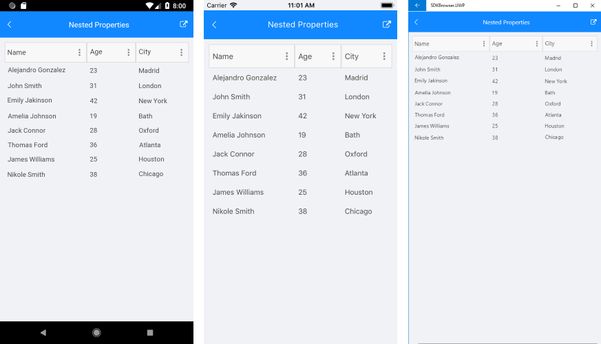

# Nested Properties Support

With R3 2018 RadDataGrid provides support for nested properties - this allows binding of complex objects to the grid columns.

In addition, the DataGrid control provides the following property:  
* **ListenForNestedPropertyChange** *(bool)*: Allows the DataGrid to listen for changes of the nested properties' values. By default it is *false*. 

>tip ListenForNestedPropertyChange is false due to optimization purposes, you could enable it in case you'd need to update the nested properties' values.

## Example

Here is an example how you could utilize the nested properties feature in DataGrid: 

First, create the needed business objects, for example type **Person** that will have property of type **Address**:

<snippet id='datagrid-nested-property-person'/>
<snippet id='datagrid-nested-proprty-address'/>

In the sample both classes inherit from NotifyPropertyChangedBase class which basically implements the INotifyPropertyChanged interface. You would need to add the following namespace to use it:

```C#
using Telerik.XamarinForms.Common;
```

Then create a ViewModel with a collection of **Person** objects:

<snippet id='datagrid-nested-property-viewmodel'/>

Finally, use the following snippet to declare a RadDataGrid in XAML: 
<snippet id='datagrid-nested-property-xaml'/>

Where the **telerikGrid** namespace is the following:

```xml
xmlns:telerikGrid="clr-namespace:Telerik.XamarinForms.DataGrid;assembly=Telerik.XamarinForms.DataGrid"
```

Here is how tha DataGrid looks:



>important An example how to apply nested properties to RadDataGrid control can be found in the DataGrid/NestedProperty folder of the [SDK Samples Browser application]().

## See Also

- [Picker Column]()
- [Template Column]()
- [Text Column]()
