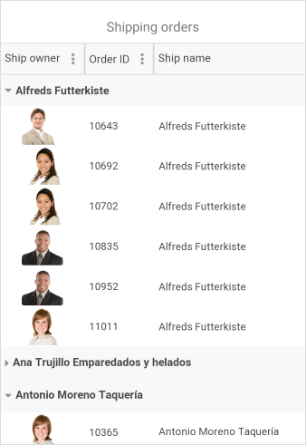

# RadDataGrid Overview #

Most of the data on the Internet is stored in tables within a database. **RadDataGrid for Xamarin** provides the same abstraction over the data – it has Columns and Rows and the intersection of a Row and a Column is called a Cell. When the data from a database is sent to the client, it is usually converted to a Business object (or the so-called ViewModel) where each instance represents a Table Row and each property of the object represents a Column within the original table.

## Key features

* **Different column types**: RadDataGrid provides plenty of built-in columns such as Text, Boolean, Numeric, ComboBox, DateTime and Template. These pre-defined templates allow for handling different data types and user scenarios, each with its specific editor. Go to [Columns]() topic for more information on this.

* **Load on Demand**: In some cases you may need to load data in the RadDataGrid when the control is already displayed as this can improve the performance of your app. RadDataGrid offers automatic data loading once the user scrolled to the last available record, or by displaying a customizable button which will initiate loading more data items. For more info go to [Load on Demand]() topic.

* **Commands**: RadDataGrid allows you to attach commands that will be executed when certain actions, such as ColumnHeaderTap, CellTap, BeginEdit, etc, occur. For detailed information on the matter go to [Commands]() article.

* **UI Virtualization**: The highly optimized data layer of the DataGrid enables fast grouping, sorting and filtering operations. The user interface uses virtualization for its row and cell elements, meaning visual elements are created only when needed and only for the currently visible cells.

* **Editing**: You could easily enable app users to edit data presented in the grid. Depending on the column data type, a relevant editor allows end users to edit content in a friendly environment. For instance, if one of the columns is a date, a date-picker will be used to offer user a change in date field. Go to [Editing]() topic for more details.

* **Sorting, Filtering, Grouping**: Easily perform SORT, FILTER or GROUP operations on your data via the intuitive user interface or with the convenient API of the DataGrid. Read the [Sorting](), [Filtering]() and [Grouping]() topic for more details.

* **Selection Modes**: DataGrid features single or multiple item selection, as well as controlling the selection unit – Cell or Row—thus enabling any selection scenario you want your Xamarin app users to have. Go to [Selection]() topic for more info.

* **Rows Alternation**: RadDataGrid supports alternating row colors so your app users can easily distinguish one row from another.

* **Styling API and Themes**: DataGrid comes with built-in theming support that allows you to easily build slick interfaces with the look-and-feel of a predefined theme. In addition, it is highly customizable should you prefer using your own styling. Read the [Styling]() topic for more details.

* **Localization**: The control has built-in localization support, which makes it easy to localize your app to any language your project demands. Read the [Localization]() topic for more details.

>tip Check out RadDataGrid [Getting Started]() help article that shows how to use it in a basic scenario.

## See Also

- [Columns]()
- [Load on Demand]()
- [Commands]()
- [Sorting]()
- [Filtering]()
- [Grouping]()
- [Selection]()
- [Styling]()
- [Localization]()
