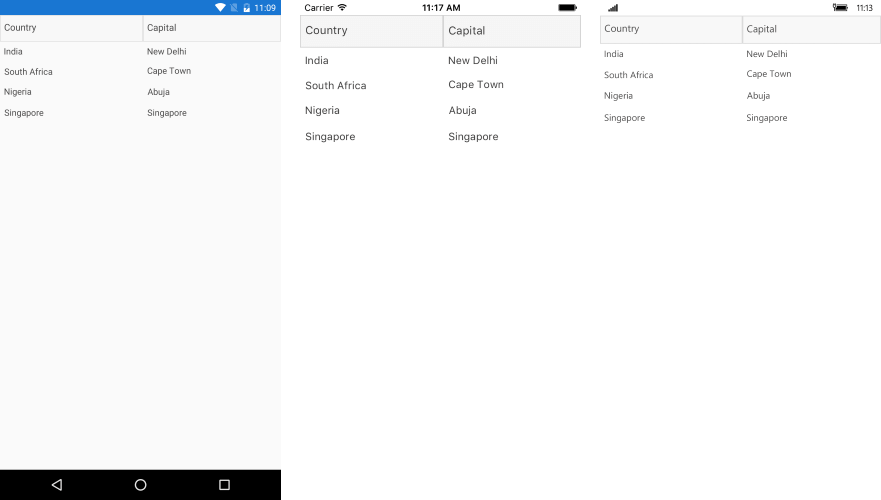

# Getting Started

This article will guide you through the steps needed to add a basic **RadDataGrid** control in your application.

* [Setting up the app](#1-setting-up-the-app)
* [Adding the required Telerik references](#2-adding-the-required-telerik-references)
* [Adding RadDataGrid control](#3-adding-raddatagrid-control)

## 1. Setting up the app

Take a look at these articles and follow the instructions to setup your app:

- [Setup app with Telerik UI for Xamarin on Windows]()
- [Setup app with Telerik UI for Xamarin on Mac]()

## 2. Adding the required Telerik references

You have two options:

* Add the Telerik UI for Xamarin Nuget package following the instructions in [Telerik NuGet package server]() topic.

If you don't want to add the all Telerik.UI.for.Xamarin nuget package, you have the option to add a separate nuget package. For RadDataGrid control you have to install the **Telerik.UI.for.Xamarin.DataGrid** nuget package. This nuget will automatically refer the *Telerik.UI.for.Xamarin.Common*, *Telerik.UI.for.Xamarin.Primitives*, *Telerik.UI.for.Xamarin.Input*, *Telerik.UI.for.Xamarin.DataControls* and *Telerik.UI.for.Xamarin.SkiaSharp* nuget packages.

* Add the references to Telerik assemblies manually, check the list below with the required assemblies for **RadDataGrid** component:

| Platform | Assemblies |
| -------- | ---------- |
| Portable | Telerik.XamarinForms.Common.dll<br/>Telerik.XamarinForms.DataGrid.dll<br/>Telerik.XamarinForms.SkiaSharp.dll |
| Android  | Telerik.Xamarin.Android.Common.dll<br/>Telerik.Xamarin.Android.Data.dll<br/>Telerik.Xamarin.Android.Input.dll<br />Telerik.Xamarin.Android.List.dll<br />Telerik.Xamarin.Android.Primitives.dll<br />Telerik.XamarinForms.Common.dll<br />Telerik.XamarinForms.DataControls.dll<br />Telerik.XamarinForms.DataGrid.dll<br />Telerik.XamarinForms.Input.dll<br />Telerik.XamarinForms.Primitives.dll<br />Telerik.XamarinForms.SkiaSharp.dll |
| iOS      | Telerik.XamarinForms.Common.dll<br/>Telerik.XamarinForms.DataGrid.dll<br/>Telerik.XamarinForms.SkiaSharp.dll |
| UWP      | Telerik.XamarinForms.Common.dll<br/>Telerik.XamarinForms.DataGrid.dll<br/>Telerik.XamarinForms.SkiaSharp.dll|

>important RadDataGrid is rendered via the **SkiaSharp** graphics library so you need to install also [SkiaSharp](https://www.nuget.org/packages/SkiaSharp/) and [SkiaSharp.Views.Forms](https://www.nuget.org/packages/SkiaSharp.Views.Forms) in all projects of the Xamarin solution (portable, android, ios, etc). 

## 3. Adding RadDataGrid control

You could use one of the following approaches:

#### Drag the control from the Toolbox. 

Take a look at the following topics on how to use the toolbox:

* [Telerik UI for Xamarin Toolbox on Windows]()
* [Telerik UI for Xamarin Toolbox on Mac]()	

#### Create the control definition in XAML:

The snippet below shows a simple RadDataGrid definition:
```XAML	
	<telerikDataGrid:RadDataGrid x:Name="DataGrid"/>
```

In addition to this, you need to add the following namespace:

```XAML
	xmlns:telerikDataGrid="clr-namespace:Telerik.XamarinForms.DataGrid;assembly=Telerik.XamarinForms.DataGrid"
```	

Now that you have added the control to your view, you need to make sure that is properly loaded with the required data. 

By default, the **RadDataGrid** control will autogenerate rows depending on the number of objects in the collection set as its **ItemsSource**. For the purpose of this article, we are going to use the following simple business objects:

```C#
 	public class Data
	{
    	public string Country { get; set; }

    	public string Capital { get; set; }
	}
```

After you have created your collection of custom objects, you should assign it to the **ItemsSource** property of the control:

```C#
 	 this.DataGrid.ItemsSource = new List<Data>
 	 {
     	new Data { Country = "India", Capital = "New Delhi"},
     	new Data { Country = "South Africa", Capital = "Cape Town"},
     	new Data { Country = "Nigeria", Capital = "Abuja" },
     	new Data { Country = "Singapore", Capital = "Singapore" } 
	 };
```

Here is the result:



>important **SDK Browser** and **QSF** applications contain different examples that show RadDataGrid's main features. You can find the applications in the **Examples** and **QSF** folders of your local **Telerik UI for Xamarin** installation.

## See Also

- [Filtering]()
- [Grouping]()
- [Sorting]()