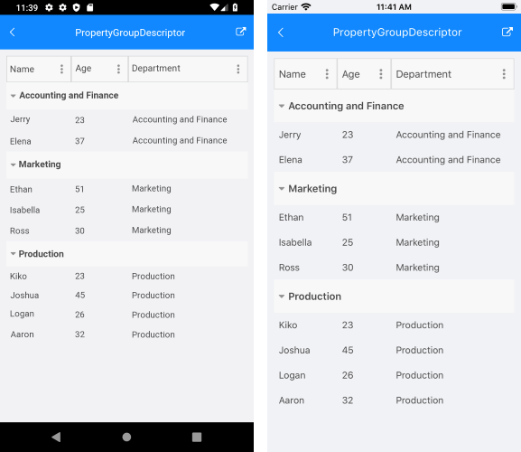

# Grouping

**RadDataGrid** supports grouping operations either through the UI - [Grouping UI](#grouping-ui) or [programmatically](#programmatic-grouping). 

## Programmatic Grouping

Programmatic grouping can be done by adding descriptors to the **GroupDescriptors** collection. There are two types of descriptors:

* [**PropertyGroupDescriptor**](#property-group-descriptor): use a property from the model as a group key.
* [**DelegateGroupDescriptor**](#delegate-group-descriptor): create a custom group key which you can use.

All GroupDescriptors are located in the Telerik.XamarinForms.Common.Data namespace:

```XAML
 xmlns:telerikCommon="clr-namespace:Telerik.XamarinForms.Common.Data;assembly=Telerik.XamarinForms.Common"
```
```C#
using Telerik.XamarinForms.Common.Data;
```

### Property Group Descriptor

The PropertyGroupDescriptor is used to group the data in a DataGrid by property from the class that defines your objects.

To use the PropertyGroupDescriptor you have to set its property PropertyName.

* **PropertyName** (string): Gets or sets the name of the property that is used to retrieve the key to group by.

>note You can easily sort the groups in ascending or descending order using the **SortOrder** property.

Let's, for example, have the following business object:

<snippet id='datagrid-grouping-propertygroupdescriptor-object' />

And a ViewModel class with a collection of **Person** objects:

<snippet id='datagrid-grouping-propertygroupdescriptor-viewmodel' />

Next snippet demonstrates how you could group the people by "Department" property through the PropertyGroupDescriptor:

```XAML
<telerikDataGrid:RadDataGrid x:Name="dataGrid"
							 ItemsSource="{Binding People}">
	<telerikDataGrid:RadDataGrid.GroupDescriptors>
		<telerikCommon:PropertyGroupDescriptor PropertyName="Department" />
	</telerikDataGrid:RadDataGrid.GroupDescriptors>
</telerikDataGrid:RadDataGrid>
```

All that is left is to set the ViewModel as BindingContext of the page:

<snippet id='datagrid-grouping-propertygroupdescriptor-setvm'/>

Here is how the RadDataGrid looks when it is grouped:



### GroupHeaderTemplate

In addition, you can create custom GroupHeaderTemplate in order to achieve the desired look when grouping the DataGrid. The BindingContext of the GroupHeader is a **GroupHeaderContext** object and it includes the following properties:

* Descriptor: Specifies the used descriptor for the grouping;
* Group: Gets details on the group such as:
	* Items: Gets the child items of the group.
	* Key: Gets the specific for the group key.
* IsExpanded: Defines a value indicating whether the group is currently expanded (has its child items visible).
* Level: Gets the zero-based level (or the depth) of the group.

The snippet below shows how the GroupHeaderTemplate is defined:

<snippet id='datagrid-grouping-groupheadertemplate' />

Check the result in the image below:


### Delegate Group Descriptor

The difference between the **DelegateGroupDescriptor** and the **PropertyGroupDescriptor** is that DelegateGroupDescriptor groups data by a custom Key while the PropertyGroupDescriptor groups by a defined Key which is a property from our model.

You have to set the following property of the DelegateGroupDescriptor:

 * **KeyLookup**: Gets or sets the **IKeyLookup** instance that is used to retrieve the group key for each data item.

>note You can easily sort the groups in ascending or descending order using the **SortOrder** property.

You have to create a class that implements the **IKeyLookup** interface which will return the Key you want to group by. Then you need to add the **DelegateGroupDescriptor** to the RadDataGrid.GroupDescriptors collection and set its **KeyLookUp** property.

Check below a sample **IKeyLookup** implementation:

<snippet id='datagrid-grouping-delegategroupdescriptor-lookup'/>

Adding it to the **GroupDescriptors** collection of the **RadDataGrid**:

<snippet id='datagrid-grouping-delegategroupdescriptor'/>

Here is how the RadDataGrid looks when it is grouped through a DelegateGroupDescriptor:


## Grouping UI

The Grouping UI  is enabled by design and it allows user to group the data by column value. The Grouping UI exposes the following property:

* **UserGroupMode**: Defines whether the Grouping UI is enabled/disabled. The available options are *Auto/Enabled/Disabled*. The default value of the UserGroupMode is *Auto*.

The following property is used to enable/disable the grouping of a specific column:

* **CanUserGroup** (bool): Defines a value indicationg whether the user can filter the column by ysing the Grouping UI.

>important A sample Grouping example can be found in the DataGrid/Grouping folder of the [SDK Samples Browser application]().

## Expand and Collapse Groups

**RadDataGrid** supports groups expand and collapse operations either through the UI by tapping on the group headers or programmatically. By default, all the groups are expanded.

This help topic will provide an overview of the methods and commands used to control the expand/collapse state of the DataGrid groups.

### Get the grouped DataGrid items

To manipulate the collapsible DataGrid groups, first you will need to call its **GetDataView** method. In short, GetDataView method provides a view of the ItemsSource after all the Sort, Group and Filter operations are applied.  The return type is *IDataViewCollection* which exposes the expand and collapse methods described in the following sections.

```C#
var dataView = this.dataGrid.GetDataView();
```

### Expand and collapse all groups 

In order to expand all groups, use the **ExpandAll** method and respectively use the **CollapseAll** method - to collapse all groups.

```C#
//expand all
var dataView = this.dataGrid.GetDataView();
dataView.ExpandAll();

//collapse all
var dataView = this.dataGrid.GetDataView();
dataView.CollapseAll();
```

### Expand and collapse a certain group

You could retrieve the first-level groups through the **GetGroups** method of the *IDataViewCollection* object and use **ExpandGroup**/**CollapseGroup** to make a certain group to expand or collapse respectively. You could check whether a group is expanded trough the **GetIsExpanded** method.

Here is quick snippet on how these methods are used:

```C# 
var dataView = this.dataGrid.GetDataView();
var rootGroups = dataView.GetGroups();

var isFirstExpanded = dataView.GetIsExpanded(rootGroups.First());
//expand a certain group
dataView.ExpandGroup(rootGroups.First());
//collapse a certain group
dataView.CollapseGroup(rootGroups.First());
```

Additionally, *IDataViewCollection* provides **ExpandItem**/**CollapseItem** methods that takes a data item as a parameter and expand/collapse the immediate group containing this item.	

```C#
var lastItem = (dataGrid.ItemsSource as IEnumerable<City>).Last();
var dataView = this.dataGrid.GetDataView();
dataView.CollapseItem(lastItem);
```

## See Also

- [Filtering]()
- [Sorting]()
- [Selection]()
