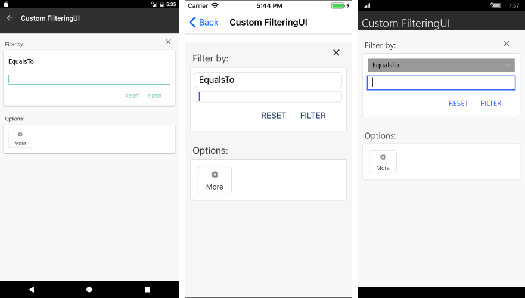

# How to Customize the Filtering UI #

You are free to customize the appearance of the filtering component which appears when clicking the options icon on each column's header. In order to create a custom filtering UI, you need to inherit from the **DataGridFilterControlBase** class. This article will guide you through the process of creating a custom control that will be used for applying the filtering. **Figure 1** shows the default appearance of the functionality

#### Figure 1: Default appearance of the filtering UI

#### 1. The first step is to create the custom Control which will inherit from the **DataGridFilterControlBase** class:

<snippet id='datagrid-customfiltering-control-xaml'/>

<snippet id='datagrid-customfiltering-control-cs'/>

You should override the required methods as shown in the C# snippet above.

#### 2. Eventually, you need to set the already created component as a filtering control for the column you need to update. This is done by creating a custom **DataGridCommand**:

<snippet id='datagrid-customfiltering-customcommand-cs'/>

**Figure 2** shows the appearance of the control once the custom filtering control is set.

#### Figure 2: Appearance of the Filtering UI after applying the custom control

>important You can review an actual sample that shows how to achieve the functionality in the **Examples/DataGrid/FilteringUI** folder from the **SDK Samples Browser** application.

## See Also

* [DataGrid Filtering]()
* [DataGrid Grouping]()
