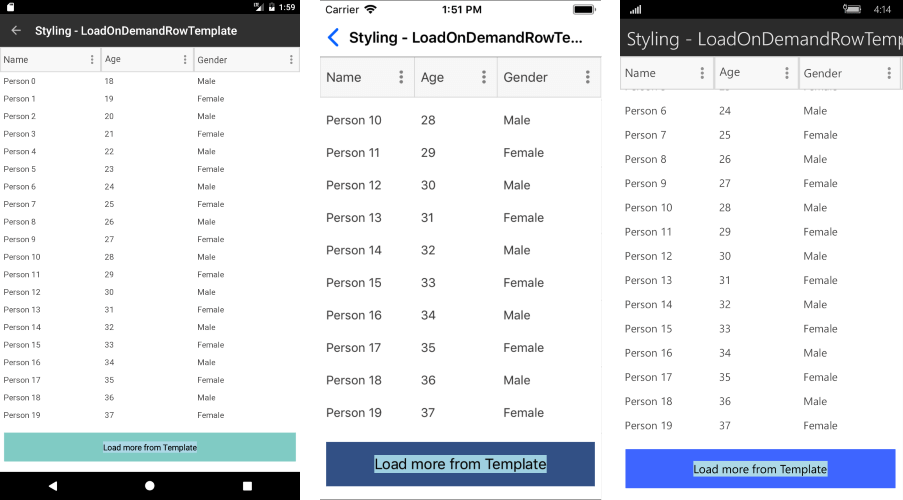

# Load On Demand #

In specific cases you may need to load data in the DataGrid when the control is already displayed as this can improve the performance and save computing resources. Loading a large data set on a mobile device has its challenges. One of the most popular approaches is using incremental data loading in the moment the items need to be visualized. 

## Configuration

DataGrid offers two loading modes which are present in the **LoadOnDemandMode** enumeration:

* **Automatic**: The load-on-demand mechanism is activated when you scroll down near the last item present in the view port. 
 
 You can control when the items will start loading more precisely by setting the **LoadOnDemandBufferItemsCount** property. It indicates at what point the additional items will start loading. For example, setting it to 20 will cause the new items to be loaded when you have scrolled the RadDataGrid so that only 20 of the originally loaded items are left below.

* **Manual**: A "Load More" button is present at the bottom of the RadDataGrid. Clicking it will load additional items based on the approach you have chosen for loading the items(through the event, the command or the collection).

## Methods to Load Data on Demand

There are three different options to load the data on demand, regardless of whether you use the **Automatic** or **Manual** loading mode. You can choose the most convenient for you based on your application requirements:

 * [Using the LoadOnDemand Collection](#using-the-loadondemand-collection)
 * [Using the LoadOnDemand event](#using-loadondemand-event)
 * [Using the LoadMoreData Command](#using-loadmoredata-command)

>All three approaches for loading items on demand in ListView work with both Automatic and Manual LoadOnDemandMode.
 
### Using the LoadOnDemand Collection

In order to use this approach, you should feed the **RadDataGrid** with a collection of type **LoadOnDemandCollection**. It is a generic type, so you need to point the type of objects it will contain. It extends the ObservableCollection&lt;T&gt; class and expects a Func&lt;CancellationToken, IEnumerable&gt; in the constructor. 

Here is a simple setup that shows how to use the collection:

1. Define a sample ViewModel class with *Items* property of type LoadOnDemandCollection:

 ```C#
public class LoadOnDemandViewModel
{
	public LoadOnDemandViewModel()
	{
		this.Items = new LoadOnDemandCollection<Person>((cancelationToken) =>
		{                
			var list = new List<Person>();
			for (int i = 0; i < 10; i++)
			{
				var person = new Person { Name = "LOD Person " + i, Age = i + 18, Gender = i % 2 == 0 ? Gender.Male : Gender.Female };
				list.Add(person);
			}
			return list;
		});

		//set initial items
		for (int i = 0; i < 20; i++)
		{
			var person = new Person { Name = "Person " + i, Age = i + 18, Gender = i % 2 == 0 ? Gender.Male : Gender.Female };
			this.Items.Add(person);
		}
	}
   
	public LoadOnDemandCollection<Person> Items { get; set; }
}
 ```

1. Add the sample *Person* data item:

 ```C#
public class Person
{
	public string Name { get; set; }
	public int Age { get; set; }
	public Gender Gender { get; set; }
}
 ```
 
1. Define RadDataGrid instance and bind its ItemsSource to the data in the ViewModel. Note the approach will work with both **Manual** and **Automatic** loading modes.

 ```XAML
<telerikGrid:RadDataGrid x:Name="dataGrid" 
				  ItemsSource="{Binding Items}"
				  LoadOnDemandMode="Manual" />
 ```

1. Set the ViewModel as BindingContext in the page constructor:

 ```C#
this.BindingContext = new LoadOnDemandViewModel();
 ```

>A sample LoadOnDemandCollection example is available in DataGrid -> LoadOnDemand folder of the [SDK Browser application](#sdk-browser-application).
>
>You can directly explore the code in the [SDK Samples Browser repository on GitHub](https://github.com/telerik/xamarin-forms-sdk/tree/master/XamarinSDK/SDKBrowser/SDKBrowser/Examples/DataGridControl/LoadOnDemandCategory/LoadOnDemandExample).
 
### Using LoadOnDemand Event

You can load new items by utilizing the **LoadOnDemand** event. It uses LoadOnDemandEventArgs arguments through which you need to indicate when the data is loaded so that the event is correctly fired afterwards. 

The example below demonstrates how to use the LoadOnDemand event:

1. Define RadDataGrid instance with LoadOnDemand event assigned:

 ```XAML
<telerikGrid:RadDataGrid x:Name="dataGrid"
				 LoadOnDemand="DataGrid_LoadOnDemand"
				 LoadOnDemandMode="Automatic"
				 LoadOnDemandBufferItemsCount="10" />
 ```

1. Set DataGrid ItemsSource in page constructor:

 ```C#
var items = new ObservableCollection<Person>();
for (int i = 0; i < 20; i++)
{
	var person = new Person { Name = "Person " + i, Age = i + 18, Gender = i % 2 == 0 ? Gender.Male : Gender.Female };
	items.Add(person);
}
this.dataGrid.ItemsSource = items;
 ```

1. Add the sample *Person* data item:

 ```C#
public class Person
{
	public string Name { get; set; }
	public int Age { get; set; }
	public Gender Gender { get; set; }
}
 ```
 
1. Add the LoadOnDemand event handler:

 ```C#
private void DataGrid_LoadOnDemand(object sender, Telerik.XamarinForms.DataGrid.LoadOnDemandEventArgs e)
{
    for (int i = 0; i < 15; i++)
    {
        ((sender as RadDataGrid).ItemsSource as ObservableCollection<Person>).Add(new Person() { Name = "Person " + i, Age = i + 18, Gender = i % 2 == 0 ? Gender.Male : Gender.Female });
    }
    e.IsDataLoaded = true;
}
 ```

>A sample LoadOnDemand Event example is available in DataGrid -> LoadOnDemandEvent folder of the [SDK Browser application](#sdk-browser-application).
>
>You can directly explore the code in the [SDK Samples Browser repository on GitHub](https://github.com/telerik/xamarin-forms-sdk/tree/master/XamarinSDK/SDKBrowser/SDKBrowser/Examples/DataGridControl/LoadOnDemandCategory/LoadOnDemandEventExample).

### Using LoadMoreData Command

The **LoadMoreData** command is another alternative which you can use which is suitable for MVVM scenarios.

Check below an example on how to create a LoadMoreData command: 

1. Add a CustomLoadMoreDataCommand class which inherits from `DataGridCommand` class and set its **Id** to `DataGridCommandId.LoadMoreData`.  Inside the Execute method add the needed logic for loading the data.

	<snippet id='datagrid-customloadmoredatacommand-csharp'/>
	
	>important Invoking the **ShowLoadOnDemandLoadingIndicator** and **HideLoadOnDemandLoadingIndicators** is a noteable part as without calling these methods the BusyIndicator used for the functionality will not be visualized.
	
1. Add a sample ViewModel class in order to load initial data:

 ```C#
public class LoadMoreDataCommandViewModel
{
    public LoadMoreDataCommandViewModel()
    {
        this.Items = new ObservableCollection<Person>();

        for (int i = 0; i < 20; i++)
        {
            var person = new Person { Name = "Person " + i, Age = i + 18, Gender = i % 2 == 0 ? Gender.Male : Gender.Female };
            this.Items.Add(person);
        }
    }

    public ObservableCollection<Person> Items { get; set; }
}
 ```
 
1. Add the sample *Person* data item:

 ```C#
public class Person
{
	public string Name { get; set; }
	public int Age { get; set; }
	public Gender Gender { get; set; }
}
 ```

1. Define the RadDataGrid instance in XAML with the `CustomLoadMoreDataCommand` command added to its **Commands** collection:

 ```XAML
<telerikGrid:RadDataGrid x:Name="dataGrid" 
                        ItemsSource="{Binding Items}"
                        LoadOnDemandMode="Automatic"
                        LoadOnDemandBufferItemsCount="10">
    <telerikGrid:RadDataGrid.Commands>
        <local:CustomLoadMoreDataCommand />
    </telerikGrid:RadDataGrid.Commands>
</telerikGrid:RadDataGrid>
 ```
 
1. Set the ViewModel as BindingContext in the page constructor:

 ```C#
this.BindingContext = new LoadMoreDataCommandViewModel();
 ```
 
>A sample LoadOnDemand Event example is available in DataGrid -> LoadMoreDataCommand folder of the [SDK Browser application](#sdk-browser-application).
>
>You can directly explore the code in the [SDK Samples Browser repository on GitHub](https://github.com/telerik/xamarin-forms-sdk/tree/master/XamarinSDK/SDKBrowser/SDKBrowser/Examples/DataGridControl/LoadOnDemandCategory/LoadMoreDataCommandExample).
 
## Styling

Besides the different approaches for loading the data, **RadDataGrid** exposes several mechanisms related to the styling of the functionality which you can use according to the approach you have chosen.

### LoadOnDemandAutoTemplate

Setting this property will modify the appearance of the load on demand indicator when the **LoadOnDemandMode** is **Automatic**.

Here is an example of custom DataTemplate:
<snippet id='datagrid-loadondemandautotemplate-xaml'/>

And how you set it to the LoadOnDemandAutoTemplate property of the RadDataGrid:
<snippet id='datagrid-setting-loadondemandautotemplate-xaml'/>

#### Figure 1: The appearance of the row after setting the LoadOnDemandAutoTemplate


### LoadOnDemandRowStyle 
This property can be used to style the appearance of the row that contains the "Load More" button when the **LoadOnDemandMode** is **Manual**.

The custom style is of type DataGridLoadOnDemandRowStyle:
<snippet id='datagrid-loadondemandrowstyle-xaml'/>

And you should set it to the LoadOnDemandRowStyle property of the RadDataGrid:
<snippet id='datagrid-setting-loadondemandrowstyle-xaml'/>

#### Figure 2: The appearance of the row after setting the LoadOnDemandRowStyle


### LoadOnDemandRowTemplate 

This property can be used to set the template of the row that contains the "Load More" button when the **LoadOnDemandMode** is **Manual**.

Here is a custom DataTemplate:
<snippet id='datagrid-loadondemandrowtemplate-xaml'/>

And how you set the property:
<snippet id='datagrid-setting-loadondemandrowtemplate-xaml'/>

#### Figure 3: The appearance of the row after setting the LoadOnDemandRowTemplate



## See Also

* [DataGrid Filtering]()
* [DataGrid Grouping]()
* [DataGrid Sorting]()
