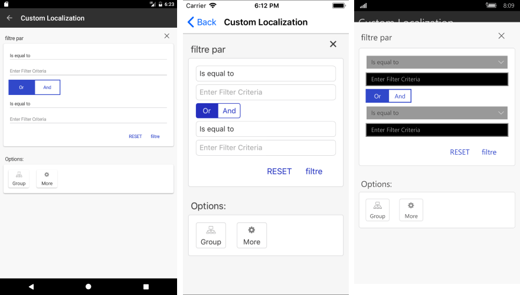

# Localization #

**RadDataGrid** supports localization (the translation of application resources into localized versions for the specific cultures or into customized resources). In order to apply the localization you need to update the TelerikLocalizationManager.Manager by either creating a custom localization manager or set its **ResourceManager** property.

## Custom TelerikLocalizationManager

You should create a custom class that inherits from **TelerikLocalizationManager** and override the **GetString()** method:

<snippet id='datagrid-custom-localizationmanager-csharp'/>

Eventually, you should set it as the **TelerikLocalizationManager.Manager**:

<snippet id='datagrid-setting-the-custom-manager-csharp'/>

>important You should set the custom manager before the InitializeComponent() method is invoked otherwise the default values will be applied to the RadDataGrid.

**Figure 1** shows the appearance of the filtering component within the RadDataGrid after the custom localization manager is applied.

#### Figure 1: Custom Localization Manager

## Custom ResourceManager

The second option for applying localization is through setting a custom **ResourceManager**:

<snippet id='datagrid-setting-the-custom-resource-manager-csharp'/> 

You should add different resource files according to the different languages/cultures which you would like to use. **Figure 2** shows an example of a custom resource file used for German:

#### Figure 2: Custom Resource File for German language

The resource file ends with "de.resx" and is automatically used when the language of your device is set to German.

**Figure 3** shows the appearance of the filtering control when the localization is applied:

#### Figure 3: Custom Resource File for German language

>important You can check a working example in the **DataGrid/Localization/CustomResourceManager** folder within the **SDK Samples Browser**.

## See Also

* [DataGrid Sorting]()
* [DataGrid Filtering]()
* [DataGrid Grouping]()
