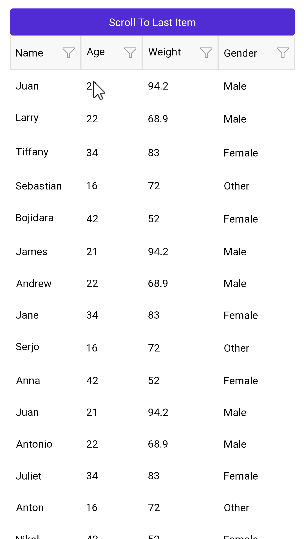

# Xamarin DataGrid Scrolling

The DataGrid has an internall scrolling mechanism. There are vertical and horizontal scrollbars for scrolling through the data in the DataGrid. 

>important Avoid nesting the DataGrid in a ScrollView and other controls that provide scrolling.

## Programmatic Scrolling

The DataGrid exposes the `ScrollItemIntoView(object item)` method for programmatic scrolling to a specific data item. `ScrollItemIntoView` brings the specified data item into the view.

>important The `ScrollItemIntoView` works in scenarios where the DataGrid Rows are with same height. For more details review the [Row Height]() article.

An example how to scroll to the last item in the DataGrid. The code executes on a button click:

```C#
private void Button_Clicked(object sender, System.EventArgs e)
{
    var item = this.vm.Clubs[this.vm.Clubs.Count - 1];
    this.grid.ScrollItemIntoView(item);
}
```



## See Also

- [Selection]()
- [Sorting]()
