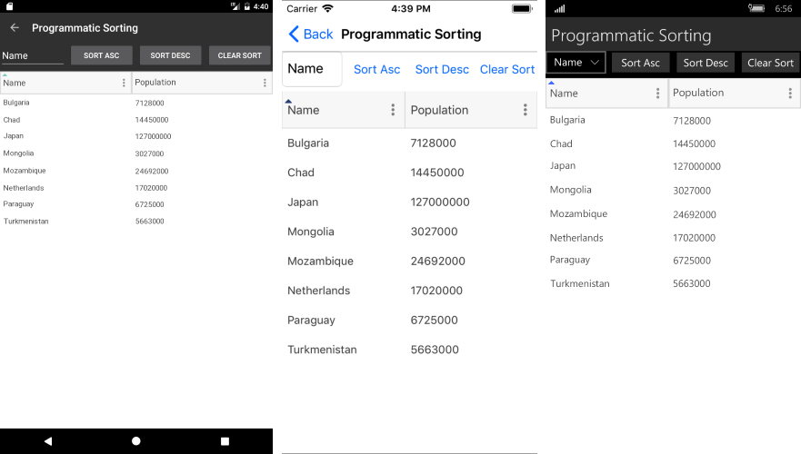

# Sorting

**RadDataGrid** provides you with a built-in sorting functionality, which allows the user to easily order the view of the data the control represents. Sorting the control is possible both through the UI and programmatically.

## Programmatic Sorting

**RadDataGrid** provides two ways of programmatic sorting:

* by Property - using a [**PropertySortDescriptor**](#property-sort-descriptor)
* by a Custom Key - using a [**DelegateSortDescriptor**](#delegate-sort-descriptor)

### Property Sort Descriptor

You can sort the data in a DataGrid by pointing a property from the class that defines your objects. This can be achieved with a **PropertySortDescriptor** and setting its **PropertyName** property. The descriptor exposes the following important properties:

* **PropertyName:** Gets or sets the name of the property that is used to retrieve the key to sort by.
* **SortOrder:** Gets or sets the order of the sorting. It can be Ascending or Descending.

<snippet id='datagrid-propertysortdescriptor-xaml'/>
```XAML
<telerikGrid:RadDataGrid.SortDescriptors>
	<telerikCommon:PropertySortDescriptor PropertyName="Name"/>
</telerikGrid:RadDataGrid.SortDescriptors>
```

where the used namespaces are defined like this:

```XAML
xmlns:telerikGrid="clr-namespace:Telerik.XamarinForms.DataGrid;assembly=Telerik.XamarinForms.DataGrid"
xmlns:telerikCommon="clr-namespace:Telerik.XamarinForms.Common.Data;assembly=Telerik.XamarinForms.Common"
```

### Delegate Sort Descriptor

The difference between the **DelegateSortDescriptor** and the **PropertySortDescriptor** is that DelegateSortDescriptor sorts data by a custom Key, while the PropertySortDescriptor sorts by a defined Key, which is a property from our model. It exposes the following properties:

* **KeyLookup**: Gets or sets the **IKeyLookup** instance that is used to retrieve the sort key for each data item.
* **SortOrder:** Gets or sets the order of the sorting. It can be Ascending or Descending.

To use a DelegateSortDescriptor, you need to create a class that implements the IKeyLookup interface which will return the Key you want to sort by. Then you need to add DelegateSortDescriptor to the RadDataGrid.SortDescriptors collection and set its KeyLookUp property.

The Custom **IKeyLookup** implementation

<snippet id='datagrid-delegatesortdescriptor-ikeylookup'/>
```C#	
public class CustomIKeyLookup : IKeyLookup
{
	public object GetKey(object instance)
	{
		return (instance as Club).Name.Length;
	}
}
```

Adding it to the **GroupDescriptors** collection of the RadDataGrid:

<snippet id='datagrid-delegatesortdescriptor-csharp'/>
```C#
this.grid.SortDescriptors.Add(new DelegateSortDescriptor() { KeyLookup = new CustomIKeyLookup()});
```

Here is how the RadDataGrid looks when sorting is applied:



## Sorting through the UI

**RadDataGrid** allows sorting through the UI by click/tap on the Column Header using the following property:

* **UserSortMode** : Defines how user input (column header tap/click) affects the current sort state of the grid. The available options are: *Auto/Multiple/None/Single*. The default value of the UserSortMode is *Auto*.

The following property is used to enable/disable the sorting of a specific column:

* **CanUserSort** (bool): Defines a value indicating whether the user can sort the data by the values in the column.

>important A sample Sorting example can be found in the DataGrid/Sorting folder of the [SDK Samples Browser application]().

## See Also

- [Filtering]()
- [Grouping]()
- [Selection]()