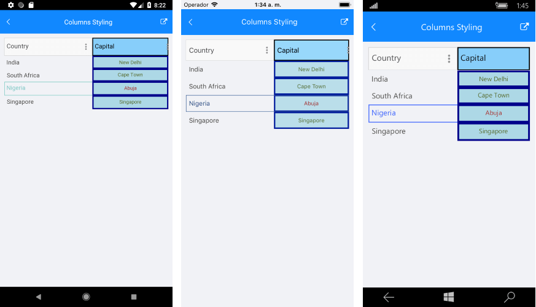

# Columns Styling

RadDataGrid component provides styling mechanism for customizing the look of the columns and their cells. 

The styling mechanism is represented by the following properties:
* **HeaderStyle** (DataGridColumnHeaderStyle)
* **CellContentStyle** (DataGridTypedColumn)
* **CellDecorationStyle** (DataGridBorderStyle)
* **CellEditorStyle** (DataGridTypedColumn)

## HeaderStyle

HeaderStyle defines the appearance of the column header. The DataGridColumnHeaderStyle exposes properties for styling its header, filter indicator, indicator, options button, sorting indicator.

### Header Styling

To style the RadDataGridColumnHeader use the following properties:

* **TextColor** and **BackgroundColor**: Define the colors of the text part/background respectively.
* **BorderColor** and **BorderThickness**: Define the style of the border around the column header.
* **Font Options** (TextFontAttributes, TextFontFamily, TextFontSize)*: Define the font options to the text part of the ColumnHeader.
* **Text Alignment** (TextMargin, HorizontalTextAlignment, VerticalTextAlignment):  Define the positioning for the text part of the ColumnHeader.

### FilterIndicator Styling

Use the following properties for styling the FilterIndicator of the ColumnsHeader.

* **FilterIndicator Font Options** (FilterIndicatorFontAttributes, FilterIndicatorFontFamily, FilterIndicatorFontSize): Define the font options for the ColumnHeader filter symbol.
* **FilterIndicatorMargin**: Defines the margin of the filter symbol of the ColumnHeader.
* **FilterIndicatorText**: Defines the text for the filter symbol of the ColumnHeader.
* **FilterIndicatorTextColor**: Defines the color of the normal state of the filter symbol.

>note Please note that once the filter operation is applied, the filter indicator will be visible in the ColumnHeader cell. Also, by default the FilterIndicator is using an internal symbol font family. To show text instead of symbol, set a font family to the **FilterIndicatorFontFamily** property and set a text to the **FilterIndicatorText** property. For more details on the filtering feature go [here]().

### SortIndicator Styling 

The **Indicator** is shown once the RadDataGridColumnHeader is sorted (tapped/clicked on the ColumnHeader cell) and can be styled with the following properties:

* **IndicatorColor**: Defines the color for the indicator part of the ColumnHeader.  
* **Indicator Font Options** (IndicatorFontAttributes, IndicatoFontFamily, IndicatoFontSize): Define the font options for the ColumnHeader indicator.
* **IndicatorMargin**: Defines the margin of the indicator part of the ColumnHeader.
* **IndicatorText**: Defines the text of the indicator part of the ColumnHeader. 
* **SortIndicatorAscendingText**: Defines the text of the sort indicator when the sorting is ascending.
* **SortIndicatorDescendingText**: Defines the text of the sort indicator when the sorting is descending.

>note By default, the indicator is using a symbol font family. To use a text instead of symbol set a font family to the **IndicatorFontFamily** property and set a text to the **IndicatorText** property. For more details on the sorting feature check [here]().

### OptionsButton Styling

The **OptionsButton** of the RadDataGridColumnHeader refers to the FilteringUI of the data grid. The style of the options button can be customized using the following properties:

* **OptonsButton Font Options** (OptonsButtonFontAttributes, OptionsButtonFontFamily, OptionsButtonFontSize): Define the font options for the ColumHeaders options button,
* **OptionsButtonMargin**: Defines the margin of the ColumnsHeader options button
* **OptionsButtonText**: Defines the text of the ColumnHeaders options button. 
* **OptionsButtonTextColor**: Defines the text color of the ColumnHeaders options button. 

>note In order to make the ColumnHeader OptionsButton hidden, set the **OptionsButtonTextColor** to transparent.  Also, please note that by default the options button is using symbol font family. To show text instead of symbol, set a font family to the **OptionsButtonFontFamily** property and set a text to the **OptionsButtonText** property.

An example how to set the HeaderStyle property is shown below:

<snippet id='datagrid-columnstyle-headerstyle'/>

## CellContentStyle

**CellContentStyle** property defines the appearance of each cell associated with the column. The target type of the Style object depends on the type of the column. For example, for **DataGridTextColumn** it will be **TextBlock** type.  You could go to Column Types section (link to Text Column) to check the TargetType of each column type. The following properties can be used to define the style of the text cell elements:

* **Font Options** (FontAttributes, FontFamily, FontSize):  Define the font of the cell text.
* **TextColor**/**SelectedTextColor**: Defines the color of the cells text, you could set different value for the selected cell.
* **Text Alignment** (TextMargin, HorizontalTextAlignment, VerticalTextAlignment): Define the positioning of the Text inside the cell.

Here is an example how to set the CellContentStyle property:

<snippet id='datagrid-columnstyle-cellcontent'/>

## CellDecorationStyle

To style the border of each cell associated with the column the **CellDecorationStyle** property is used. The TargetType property of the Style object is Rectangle. The following properties are used to define the Rectangle Style: BackgroundColor, BorderColor, BorderTickness).

Here is an example how to set those properties on a column:

<snippet id='datagrid-columnstyle-celldecoration'/>

## CellEditorStyle

**CellEditorStyle** defines the style that will be applied to the cell editor.

Here is an example how to set this property:

<snippet id='datagrid-columnstyle-celleditor'/>

And this is how the column style looks when the properties are applied for customizing the column are applied: 

>important [SDK Samples Browser application]() contains Columns Styling example in the DataGrid/Styling folder.  

## See Also

- [DataGrid Styling]()
- [Style Selectors]()
- [How To]()

