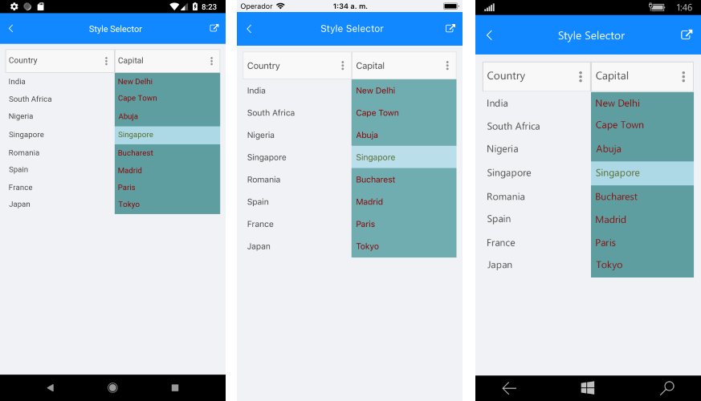

# Style Selectors

RadDataGrid component exposes conditional styling feature. It allows users to apply different Style on a cell or per group header depending on a specific condition. 

You could set different style on a specific cell from a specific column based on a custom selection logic with the following properties:

* **CellContentStyleSelector**: Style the content of the cell using the text alignment options (TextMargin, HorizontalTextAlignment, VerticalTextAlignment), font options (FontAttributes, FontFamily, FontSize) and TextColor property 
* **CellDecorationStyleSelector**: Style the decoration on a cell

Different style can be applied on a per group header once the RadDataGrid control is grouped using **GroupHeaderStyleSelector** property. 

The CellContentStyleSelector, CellDecorationStyleSelector and GroupStyleSelector use the **SelectStyle** method to change the style.

## Example

The following example will demonstrate how to apply the style selectors in the RadDataGrid control:

Let’s add the RadDataGrid control and set the **CellContentStyleSelector** to be static resource from type *MyCellContentStyleSelector*, **CellDecorationStyleSelector** as a static resource from type *MyCellDecorationStyleSelector* and **GroupStyleSelector** as a static resource from type *MyGroupStyleSelector*. 

Here is an example:

<snippet id='datagrid-styleselector-example'/>

and let’s create a simple data for the RadDataGrid control:

<snippet id='datagrid-styleselector-data'/>

<snippet id='datagrid-styleselector-items'/>

As a next step you need to add *MyCellContentStyleSelector*, *MyCellDecorationStyleSelector* and *MyGroupStyleSelector* as resources in the Resource page of the app:

<snippet id='datagrid-styleselectors'/>

Let’s create a custom class for each selector and this class derives from **DataGridStyleSelector** and overrides its **SelectStyle** method

MyCellContentStyleSelector class implementation is as follow:

<snippet id='datagrid-styleselector-cellcontent'/>

MyCellDecorationStyleSelector class implementation is shown below:

<snippet id='datagrid-styleselector-celldecoration'/>

MyGroupStyleSelector could be implemented as follow:

<snippet id='datagrid-styleselector-group'/>

This is how the RadDataGrid control will look when CellContentStyleSelector is applied.

>important [SDK Samples Browser application]() contains Style Selector example in the DataGrid/Styling folder. 

## See Also

- [DataGrid Styling]()
- [Columns Styling]()
- [How To]()
