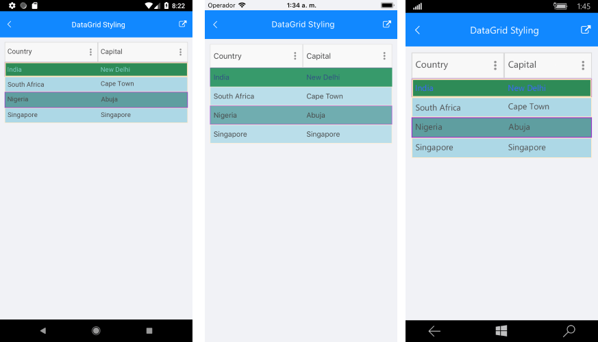

# DataGrid Styling

RadDataGrid control provides the following Style properties for customizing its look & feel:

* **RowBackgroundStyle**: Defines the style of each row.
* **AlternateRowBackgroundStyle**: Defines the appearance style of an alternate row.
* **GroupHeaderStyle**: Defines the appearance style of the group header once the data grid is grouped.
* **SelectionStyle**: Defines the appearance setting applied to the DataGrid selected row.

## Styling Properties

RowBackgroundStyle, AlternateRowBackgroundStyle and SelectionStyle are from type *DataGridBorderStyle* that defines the appearance setting applied to a BorderPaintable instance and exposes the following properties: **BackgroundColor**, **BorderColor**, **BorderTickness**.

Here is an example how to set the RowBackgroundStyle property:

<snippet id='datagrid-styling-rowbackgroundstyle'/>

An example how to set the AlternateRowBackgroundStyle is shown below:

<snippet id='datagrid-styling-alternaterowbackgroundstyle'/>

The SelectionStyle property could be set as shown below:

<snippet id='datagrid-styling-selectionstyle'/>

GoupHeaderStyle property is applied once the DataGrid is grouped. The following properties can be used for customizing the grouped DataGrid:

* **BackgroundColor**: Defines the color that fills the area within the header of the DataGrid’s GroupHeader.
* **BorderColor**: Defines the that fills the border region of the GroupHeader
* **BorderThickness**: Defines the thickness of the border.
* **Button Font Options** (ButtonFontAttributes, ButtonFontFamily, ButtonFontSize): Define the font options of the GroupedHeader expand/collapse symbol.
* **ButtonMargin**: Defines the margin of the expand/collapse symbol of the GroupHeader.
* **ButtonTextColor**: Defines the text color of the expand/collapse symbol of the GroupHeader.
* **CollapseButtonText**: Defines the text for the collapse state of the GroupHeader.
* **ExpandButtonText**: Defines the text for the expand state of the GroupHeader.
* **Text Alignment** (TextMargin, VerticalTextAlignment, HorizontalTextAlignment): Define the positioning for the text part of the GroupHeader.
* **Text Font Options** (TextFontattributes, TextFontFamily, TextFontSize): Define the font options of the GroupHeaders text part. 

>note Please note that once the group is applied to the DataGrid the GroupHeader will appear. Also, by default the Button of the GroupHeader uses an internal symbol font family. In order to show text when the button is expanded/collapsed instead of symbol set a font family to the **ButtonFontFamily** property and set a text to the **ExpandButtonText** and **CollapseButtonText** properties. For more details on the group feature refer [here]().

Here is an example how to apply the GoupHeaderStyle property to the RadDataGrid control:

<snippet id='datagrid-styling-groupheaderstyle'/>

Here is how the RadDataGrid looks:

>important [SDK Samples Browser application]() contains DataGridStyling example in the DataGrid/Styling folder. 

## See Also

- [Columns Styling]()
- [Style Selectors]()
- [How To]()