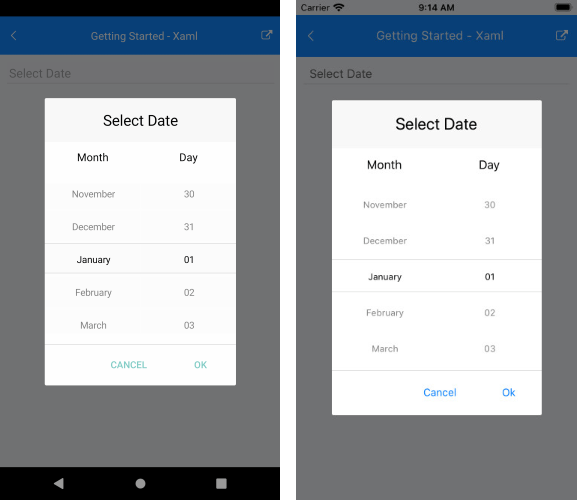
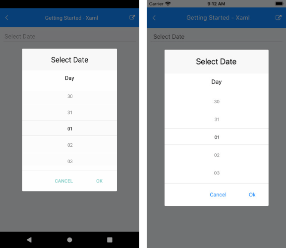

# String Format

Date Picker for Xamarin allows you to use standard or custom date format strings through the SpinnerFormat property. Depending on what format is set, the picker visualizes spinner controls with prepopulated values to be picked.

* **SpinnerFormat**(*string*): Defines the string format for the spinners. The default format is **"g"**.

The available Standard Date format strings that can be set to the SpinnerFormat property are described in the table below:

| Supported Standard Date and Time Format String |
| -------- |
| "g" |
| "G" |
| "d" |
| "dd" |
| "M" |
| "MM" |
| "MMM" |
| "MMMM" |
| "y" |
| "yyy" |
| "yyyy" |
| "MM/dd/yyyy|
| "M/d/y|
| "MMMM, dd, yyyy" |
| "MMMM dd" |
| "yyyy/MMM/dd" |

>important You can set only short [Standard Date Format Strings](https://docs.microsoft.com/en-us/dotnet/standard/base-types/standard-date-and-time-format-strings) to the DateTime Picker control.

## Supported Separators

When SpinnerFormatString is set and device culture is changed, the separators used for the format string won't be changed:

| Supported Date and Time Separators Formats |
| -------- |
| "-" |
| "." |
| "," |
| " " |
| ":" |
| "/" |
| "[" |
| "]" |

## Examples

### SpinnerFormat="MMMM dd"

```XAML
<telerikInput:RadDatePicker SpinnerFormat="MMMM dd" />
```

And the result:



### SpinnerFormat="dd"

```XAML
<telerikInput:RadDatePicker SpinnerFormat="dd" />
```

And the result:



### SpinnerFormat="MMM yyyy"

```XAML
<telerikInput:RadDatePicker SpinnerFormat="MMM yyyy" />
```

And the result:


### SpinnerFormat="yyyy/dd/MMM"

```XAML
<telerikInput:RadDatePicker SpinnerFormat="yyyy/dd/MMM" />
```

And the result:


## See Also

- [Templates]()
- [Styling]()
- [Events]()
- [Methods]()
- [Commands]()
