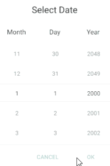
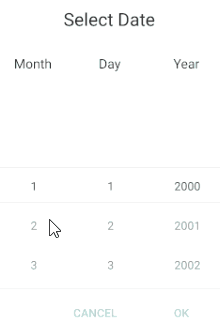

# Key Features

The purpose of this help article is to show you the key features of the Date Picker control for Xamarin. 

## Date Range

Date Picker allows you to define a date range and choose a date in between through the following properties:

* **MinimumDate**(*DateTime*): Defines a date which marks the deginning of the range of the available dates. The default value is `DateTime(2000,1,1)`.

* **MaximumDate**(*DateTime*): Defines a date which marks the end of the range of the available dates to choose from. The default value is `DateTime(2099, 12, 31, 23, 59, 59)`.

### Example

<snippet id='datepicker-keyfeatures-minmaxdate' />

and use the following namespace:

```XAML
xmlns:telerikInput="clr-namespace:Telerik.XamarinForms.Input;assembly=Telerik.XamarinForms.Input"
```

## Current Selected Date

* **Date**(*DateTime?*): Defines the current date selection. The default value is null.

### Example 

<snippet id='datepicker-keyfeatures-date-spinnerformat' />

and add the following namespace:

```XAML
xmlns:telerikInput="clr-namespace:Telerik.XamarinForms.Input;assembly=Telerik.XamarinForms.Input"
```

## DefaultHighlightedDate

RadDateTime Picker DefaultHighlightedDate(*DateTime*) defines the System.DateTime which will be used to pre-scroll each spinner when RadDatePicker.Date property is set to null.

### Example

```XAML
<telerikInput:RadDateTimePicker Date="{x:Null}"
                                DefaultHighlightedDate="2020,05,15"
                                SpinnerFormat="dd/MMM/yyyy"/>
```

and the namespace needed:

```XAML
xmlns:telerikInput="clr-namespace:Telerik.XamarinForms.Input;assembly=Telerik.XamarinForms.Input"
```

## DisplayString Format

* **DisplayStringFormat**(*string*): Defines the format of the string that will be visualized when the picker dialog is closed. 

>note The format set for **DisplayStringFormat** should be a valid date format. 

### Example

Here is a sample Date Picker definition:

<snippet id='datepicker-keyfeatures-date-defaulthighlighted' />

In addition to this, you need to add the following namespace:

```XAML
xmlns:telerikInput="clr-namespace:Telerik.XamarinForms.Input;assembly=Telerik.XamarinForms.Input"
```

## IsLooping property

The DatePicker exposes **IsLooping** boolean property which indicates whether the items in the popup should loop infinitely while scrolling. By default looping is enabled, to disable it, just set **IsLooping** to *False*.

```XAML
<telerikInput:RadDatePicker IsLooping="False" />
```

Check the difference in the behavior according to **IsLooping** below:

#### IsLooping set to True (default)



#### IsLooping set to False




>important A sample Key Features example can be found in the DatePicker/Features folder of the [SDK Samples Browser application](#sdk-browser-application).

## See Also

- [Templates]()
- [Styling]()
- [Commands]()
- [Selection]()
