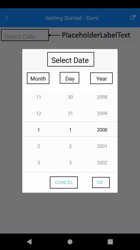

# Date Picker Localization

RadDate Picker for Xamarin provides language localization. In short, you can translate the used across the Date Picker texts to other languages, so that your app can be adapted to different regions.

>important To learn in details about the localization process of Telerik UI for Xamarin components, please go through the common [Localization and Globalization]() topic.

The sections below list all the localization keys used in Date Picker for Xamarin control.

## Date Picker Header Localization Key

| Localization Key | Default Value |
| -----------------| ------------- |
| DatePicker_Popup_HeaderLabelText  | Select Date |
| DatePicker_PlaceholderLabelText  | Select Date |

## Common Picker Localizations strings

| Localization Key | Default Value |
| -----------------| ------------- |
| Picker_DaySpinnerHeaderLabelText  | Day |
| Picker_MonthSpinnerHeaderLabelText  | Month |
| Picker_YearSpinnerHeaderLabelText  | Year |
| Picker_Popup_AcceptButtonText  | OK |
| Picker_Popup_CancelButtonText  | Cancel |

Check in the image below how the localization strings are presented in Date Picker:

## See Also

* [Localization and Globalization]()
