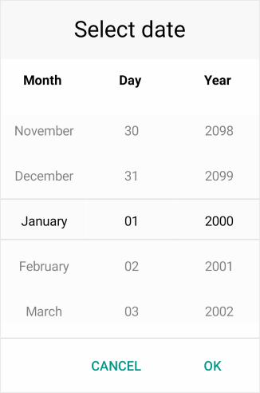

# Overview

**Telerik Date Picker for Xamarin** allows the users to select a date. Its items are visualized inside a popup. Date Picker control has a number of features which allows you to set a date range, date format and fully customize the dialog appearance such as its header and footer.  

## Key features

* **String Format**: Date Picker for Xamarin allows you to use standard or custom date format string through the DatePicker.SpinnerFormat property. Depending on what format is set, the picker visualizes spinner controls with prepopulated values to be picked. For more information check the [Date Format String]() article in our documentation.

* **Templates**: Date Picker provides templates for its header and footer. Also we have exposed templates for the picker placeholder and display text. For additional info go to [Templates]() article.

* **DisplayString Format**: You can choose what text to be displayed when a date is selected using the Date Picker DisplayStringFormat property. For more info on this check the [Key Features - DisplayString Format](#displaystring-format) section.

* **Date Range**: RadDate Picker allows you to define a date range when setting minimum and maximum date values and choose a date in between. To learn more about this, visit [Key Features Date Range](#date-range) section.

* **Flexible Styling API**: Take advantage of the styling capabilities of the RadDatePicker control. You can easily style its Spinners, the Popup and its header and footer, the text displayed after date is selected and many [more]().

* **Commands Support**: Date Picker exposes command that allows you to clear the selected date - **Clear Command** and **Toggle Command** that allows you to open and close the dialog. More information about Commands support check our help article [here]().

>tip Check out Date Picker for Xamarin [Getting Started]() help article that shows how to use it in a basic scenario.

## See Also

- [Visual Structure]()
- [Getting Started]()
- [Key Features]()
- [Templates]()
- [Styling]()