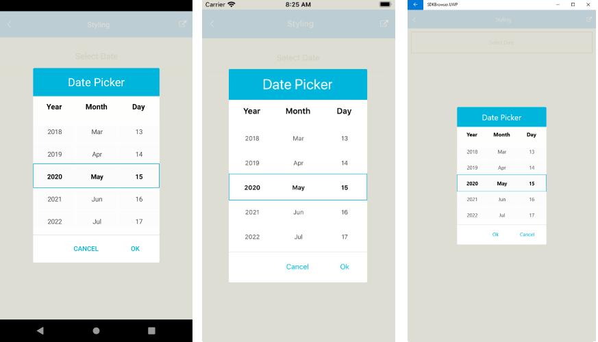

# Styling

## DatePicker Styling

Date Picker control for Xamrin provides the following Style properties for customizing its look:

* **SpinnerStyle**(of type *Style* with target type **telerikDataControls:RadSpinner**): Defines the style applied to the spinner item and selected item.
* **SpinnerHeaderStyle**(of type *Style* with target type **Xamarin.Forms.Label**): Specifies the style applied to each spinner header label.
* **SelectionHighlightStyle**(of type *Style* with target type **telerikPrimitives:RadBorder**): Specifies the style applied to the border highlights the selection.
* **PlaceholderLabelStyle**(of type *Style* with target type **Xamarin.Forms.Label**): Specifies the style applied to the label defined in the [default PlaceholderTemplate](#default-placeholdertemplate). 
* **DisplayLabelStyle**(of type *Style* with target type **Xamarin.Forms.Label**): Defines the style applied to the label which is visualized when date is selected.

PickerContentView class exposes the following properties for styling the DatePicker Border and Background Color:

* **BackgroundColor**(*Xamarin.Forms.Color*): Defines the background color of the picker.
* **BorderColor**(*Xamarin.Forms.Color*): Defines the border color of the picker.
* **BorderThichness**(*Xamarin.Forms.Thickness*): Specifies the border thickness of the picker.
* **CornerRadius**(*Xamarin.Forms.Thinckness*): Specifies the corner radius of the picker.

## Popup Styling

Using the **SelectorSettings** property (*of type Telerik.XamarinForms.Input.PickerPopupSelectorSettings*) of the DatePicker you can modify the appearance of the dialog (popup). PickerPopupSelectorSettings class exposes the following Style properties:

* **PopupViewStyle**(of type *Style* with target type **telerikInput:PickerPopupContentView**): Defines the popup view style.
* **HeaderStyle**(of type *Style* with target type **telerikInput:PickerPopupHeaderView**): Defines the popup header style.
* **HeaderLabelStyle**(of type *Style* with target type **Xamarin.Forms.Label**): Defines the popup header label style.
* **FooterStyle**(of type *Style* with target type **telerikInput:PickerPopupFooterView**): Defines the popup footer style.
* **AcceptButtonStyle**(of type *Style* with target type **Xamarin.Forms.Button**): Defines the Accept button style.
* **CancelButtonStyle**(of type *Style* with target type **Xamarin.Forms.Button**): Defines the Cancel button style.

The SelectorSetting also provides the following properties for popup customization:

* **PopupOutsideBackgroundColor**(*Xamarin.Forms.Color*): Defines the color outside of the popup.
* **IsPopupModal**(*bool*): Defines a boolean value indicating if the popup should be closed when tapped outside of the popup. By default the value of the **IsPopupModal** is **false**.
	* When *IsPopupModal="True"*  the UI behind the popup gets inactive and cannot be used until the popup is closed. 
	* When *IsPopupModal="False"* the popup could be closed when clicking outside the popup. 	
	
* **HeaderLabelText**(*string*): Specifies the text visualized in the popup header.
* **AcceptButtonText**(*string*): Defines the text visualized for the accept button. By default the text is *OK*.
* **CancelButtonText**(*string*): Defines the text visualized for the cancel button. By default the text is *Cancel*. 

## Namespaces

Using **PopupViewStyle**, **HeaderStyle**, **FooterStyle** you will need to add the following namespace:

```XAML
xmlns:telerikInput="clr-namespace:Telerik.XamarinForms.Input;assembly=Telerik.XamarinForms.Input"
```

Using **SelectionHighlightStyle** you need to add the following namespace:

```XAML
xmlns:telerikPrimitives="clr-namespace:Telerik.XamarinForms.Primitives;assembly=Telerik.XamarinForms.Primitives"
```

Using **SpinnerStyle** you need to add the following namespace:

```XAML
xmlns:telerikDataControls="clr-namespace:Telerik.XamarinForms.DataControls;assembly=Telerik.XamarinForms.DataControls"
```

## Example

Here is a sample example that shows how the styling properties are applied.

A sample **Date Picker** definition:

<snippet id='datepicker-style' />

and here are how the styles are defined in the page resources

## Spinner Style

<snippet id='datepicker-style-spinner-style' />

## SpinnerHeader Style

<snippet id='datepicker-style-spinner-header-style' />

## SelectionHighlight Style

<snippet id='datepicker-style-selection-highlight-style' />

## PlaceholderLabel Style

<snippet id='datepicker-style-placeholder-label-style' />

## DisplayLabel Style

<snippet id='datepicker-style-display-label-style' />

## PopupView Style

<snippet id='datepicker-style-popupview-style' />

## Header Style

<snippet id='datepicker-style-header-style' />

## HeaderLabel Style

<snippet id='datepicker-style-header-label-style' />

## Footer Style

<snippet id='datepicker-style-footer-style' />

## AcceptButton Style

<snippet id='datepicker-style-accept-button-style' />

## CancelButton Style

<snippet id='datepicker-style-cancel-button-style' />

## Namespaces

In addition, add the following namespaces:

```XAML
xmlns:telerikInput="clr-namespace:Telerik.XamarinForms.Input;assembly=Telerik.XamarinForms.Input"
xmlns:telerikDataControls="clr-namespace:Telerik.XamarinForms.DataControls;assembly=Telerik.XamarinForms.DataControls"
xmlns:telerikPrimitives="clr-namespace:Telerik.XamarinForms.Primitives;assembly=Telerik.XamarinForms.Primitives"
```

This is how the Date Picker control looks when the styles described above are applied:



>important A sample Styling example can be found in the DatePicker/Features folder of the [SDK Samples Browser application]().

## See Also

- [Key Features]()
- [Templates]()
- [Commands]()
- [Visual Structure]()
