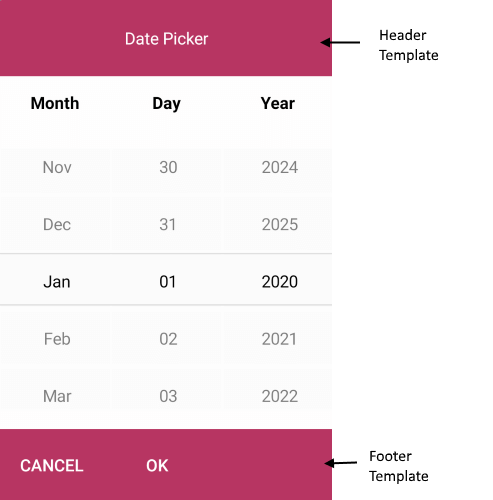

# Templates

If the default templates of the control do not suit your needs, you can easily define custom ones. The available templates for customizing are:

* **PlaceholderTemplate**(*ControlTemplate*): Defines the template visualized for the placeholder.  
* **DisplayTemplate**(*ControlTemplate*): Defines the template visualized when the picked date/time is displayed.
* **HeaderTemplate**(*ControlTemplate*): Defines what will be displayed inside the dialog(popup) header.
* **FooterTemplate**(*ControlTemplate*): Defines what will be displayed inside the dialog(popup) footer.

## PlaceholderTemplate

<snippet id='datepicker-placeholder-default-template' />

## DisplayTemplate

<snippet id='datepicker-display-default-template' />

## HeaderTemplate

<snippet id='datepicker-header-default-template' />

## FooterTemplate

<snippet id='datepicker-footer-default-template' />

and the Date Picker definition:

```XAML
<telerikInput:RadDatePicker MinimumDate="2020,01,1" 
                            MaximumDate="2025,12,31"
                            SpinnerFormat="MMM/dd/yyyy"
                            PlaceholderTemplate="{StaticResource Picker_PlaceholderView_ControlTemplate}"
                            DisplayTemplate="{StaticResource Picker_DisplayView_ControlTemplate}">
    <telerikInput:RadDatePicker.SelectorSettings>
        <telerikInput:PickerPopupSelectorSettings HeaderTemplate="{StaticResource PopupView_Header_ControlTemplate}"
                                                  HeaderLabelText="Date Picker"
                                                  FooterTemplate="{StaticResource PopupView_Footer_ControlTemplate}"/>
    </telerikInput:RadDatePicker.SelectorSettings>
</telerikInput:RadDatePicker>
```

>important A sample Default Templates example can be found in the DatePicker/Features folder of the [SDK Samples Browser application]().

## Example How to Customize the Default Look

The snippet below shows a simple Date Picker definition:

<snippet id='datepicker-custom-templates' />

Now lets add the templates definition to the page resources:

### Custom PlaceholderTemplate

<snippet id='datepicker-placeholder-template' />


### Custom DisplayTemplate

<snippet id='datepicker-display-template' />


### Custom HeaderTemplate

<snippet id='datepicker-header-template' />

### Custom FooterTemplate

<snippet id='datepicker-footer-template' />



In addition to this, you need to add the following namespace:

```XAML
xmlns:telerikInput="clr-namespace:Telerik.XamarinForms.Input;assembly=Telerik.XamarinForms.Input"
```

>important A sample Custom Templates example can be found in the DatePicker/Features folder of the [SDK Samples Browser application]().

## See Also

- [Suppoted Standard Date Format Strings]()
- [Key Features]()
- [Styling]()