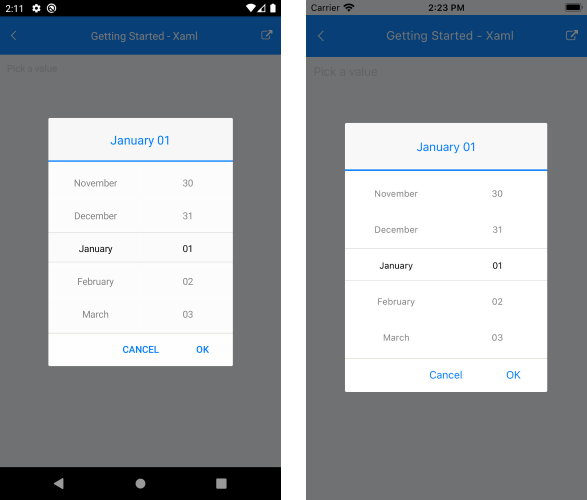
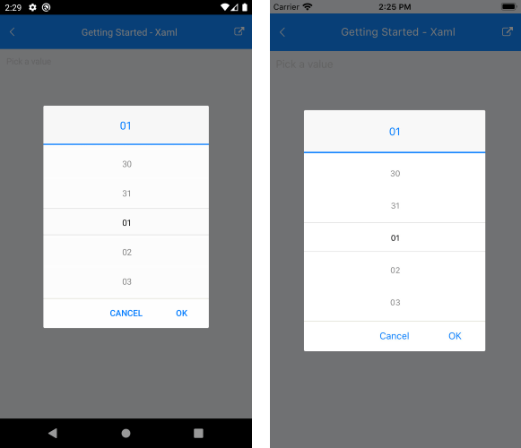
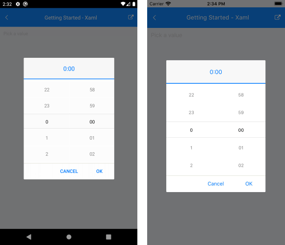

# String Format

Date and Time Picker for Xamarin allows you to use standard or custom date and time format strings through the SpinnerFormat property. Depending on what format is set, the picker visualizes spinner controls with prepopulated values to be picked. This feature allows you to create a date picker, time picker or combination of both.

* **SpinnerFormat**(*string*): Defines the string format for the spinners. The default format is **"g"**.

## Standard Date and Time Format Strings

The available Standard Date and Time format strings that can be set to the SpinnerFormat property are described in the table below:

| Supported Standard Date Format String | Description |
| -------- || -------- |
| "d" | Short Date Format. Invariant culture format is MM/dd/yyyy |
| "G" | Short Date "d" and Long Time "T" |
| "g" | Short Date "d" and Short Time "t" |
| "M" | Month Format Specifier |
| "m" | Month Format specifier |
| "Y" | Year Month Format Specifier |
| "y" | Year Month Format Specifier |
| "T" | Long Time Format Specifier |
| "t" | Short Time Format Specifier |

>important You can set only short [Standard Date and Time Format Strings](https://docs.microsoft.com/en-us/dotnet/standard/base-types/standard-date-and-time-format-strings) to the DateTime Picker control.

## Custom Date and Time Format String

The available Custom Date and Time format strings that can be set to the SpinnerFormat property are described in the table below:

| Supported Custom Date Format Strings|
| -------- |
| "d" |
| "dd" |
| "M" |
| "MM" |
| "MMM" |
| "MMMM" |
| "y" |
| "yy" |
| "yyy" |
| "yyyy" |
| "H" |
| "HH" |
| "h" |
| "hh" |
| "m" |
| "mm" |
| "s" |
| "ss" |
| "t" |
| "tt" |

>important You can set only short [Custom Date and Time Format Strings](https://docs.microsoft.com/en-us/dotnet/standard/base-types/custom-date-and-time-format-strings) to the DateTime Picker control.

## Supported Separators

When SpinnerFormat is set and device culture is changed, the separators used for the format string won't be changed:

| Supported Date and Time Separators Formats |
| -------- |
| "-" |
| "." |
| "'" |
| " " |
| ":" |
| "/" |

## Examples

### SpinnerFormat="MMMM dd"

```XAML
<telerikInput:RadDateTimePicker SpinnerFormat="MMMM dd" />
```

And the result:



### SpinnerFormat="dd"

```XAML
<telerikInput:RadDateTimePicker SpinnerFormat="dd" />
```

And the result:



### SpinnerFormat="H:mm"

```XAML
<telerikInput:RadDateTimePicker SpinnerFormat="H:mm" />
```

And the result:



## See Also

- [Templates]()
- [Styling]()
- [Events]()
- [Methods]()
- [Commands]()
