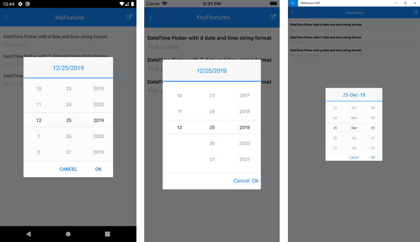
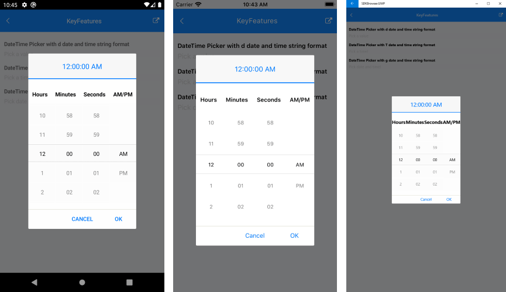
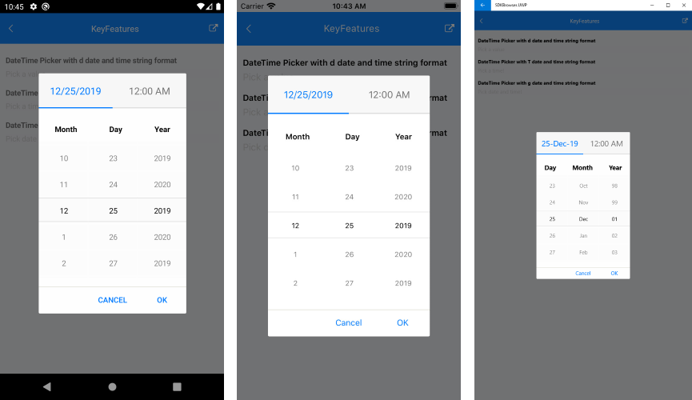

# Key Features

The purpose of this help article is to show you the key features of the Date and Time Picker control for Xamarin. 

## Date Picker

The snippet below shows a simple Date Picker definition:

<snippet id='datetimepicker-keyfeatures-date' />

Here is how the Date Picker looks when Date Format String is applied:

## Time Picker

The snippet below shows a simple Time Picker definition:

<snippet id='datetimepicker-keyfeatures-time' />

Here is how the Time Picker looks when Time Format String is applied:

## DateTime Picker

The snippet below shows a simple Date and Time Picker definition:

<snippet id='datetimepicker-keyfeatures-date-time' />

Here is how the Date and Time Picker looks when Date and Time Format String is applied:

## Date Range

RadDateTime Picker allows you to define a particular start and end date and choose a date in between through the following properties:

* **StartDate**(*DateTime*): Defines the start date of the date time picker.

* **EndDate**(*DateTime*): Defines the end date of the date time picker.

* **SelectedDate**(*DateTime?*): Defines the date which will be selected when the picker dialog is open.

## DisplayString Format

* **DisplayStringFormat**(*string*): Defines the format of the string that will be visualized when the picker dialog is closed. 

>note The format set for **DisplayStringFormat** should be a valid datetime format. 

>important A sample Key Features example can be found in the DateTimePicker/Features folder of the [SDK Samples Browser application](#sdk-browser-application).

## See Also

- [Templates]()
- [Styling]()
- [Events]()
- [Commands]()
- [Methods]()
