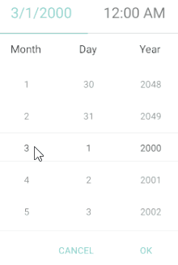
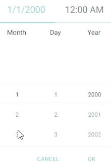

# Key Features

The purpose of this help article is to show you the key features of the Date and Time Picker control for Xamarin. 

## DateTime Picker

The snippet below shows a simple Date and Time Picker definition:

<snippet id='datetimepicker-keyfeatures-date-time' />

In addition to this, you need to add the following namespace:

```XAML
xmlns:telerikInput="clr-namespace:Telerik.XamarinForms.Input;assembly=Telerik.XamarinForms.Input"
```

Here is how the Date and Time Picker looks when Date and Time Format String is applied:


## Date Range

RadDateTime Picker allows you to define a minimum date and maximum date and choose a date in between through the following properties:

* **MinimumDate**(*DateTime*): Defines a date which marks the deginning of the range of the available dates. The default value is `DateTime(2000,1,1, 0, 0, 0)`.

* **MaximumDate**(*DateTime*): Defines a date which marks the end of the range of the available dates to choose from. The default value is `DateTime(2099, 12, 31, 23, 59, 59)`.

## Current Selected Date

* **Date**(*DateTime?*): Defines the current date selection. The default value is null.

## DefaultHighlightedDate

RadDateTime Picker DefaultHighlightedDate(*DateTime*) defines the System.DateTime which will be used to pre-scroll each spinner when **RadDateTimePicker.Date** property is set to null.

### Example

```XAML
<telerikInput:RadDateTimePicker SelectedDate="{x:Null}"
                                DefaultDisplayDate="2020,02,14"
                                SpinnerFormatString="d"/>
```

## Incremental Time Steps

By default, the time component of the DateTime Picker increments or decrements each part of its time values by one step. You can change the default setup using the following properties:

* **HourStep**(*int*): Controls the incremental step of the hour value. Default value is 1.
* **MinuteStep**(*int*): Controls the incremental step of the minute value. Default value is 1.
* **SecondStep**(*int*): Controls the incremental step of the second value. Default value is 1.

## DisplayString Format

* **DisplayStringFormat**(*string*): Defines the format of the string that will be visualized when the picker dialog is closed. 

>note The format set for **DisplayStringFormat** should be a valid datetime format. 

## Date Picker Mode

The snippet below shows a simple Date Picker definition:

<snippet id='datetimepicker-keyfeatures-date' />

In addition to this, you need to add the following namespace:

```XAML
xmlns:telerikInput="clr-namespace:Telerik.XamarinForms.Input;assembly=Telerik.XamarinForms.Input"
```

Here is how the Date Picker looks when Date Format String is applied:


## Time Picker Mode

The snippet below shows a simple Time Picker definition:

<snippet id='datetimepicker-keyfeatures-time' />

In addition to this, you need to add the following namespace:

```XAML
xmlns:telerikInput="clr-namespace:Telerik.XamarinForms.Input;assembly=Telerik.XamarinForms.Input"
```

Here is how the Time Picker looks when Time Format String is applied:


## IsLooping property

The DateTimePicker exposes **IsLooping** boolean property which indicates whether the items in the popup should loop infinitely while scrolling. By default looping is enabled, to disable it, just set **IsLooping** to *False*.

```XAML
<telerikInput:RadDateTimePicker IsLooping="False" />
```

Check the difference in the behavior according to **IsLooping** below:

#### IsLooping set to True (default)



#### IsLooping set to False




>important A sample Key Features example can be found in the DateTimePicker/Features folder of the [SDK Samples Browser application](#sdk-browser-application).

## See Also

- [Templates]()
- [Styling]()
- [Commands]()
