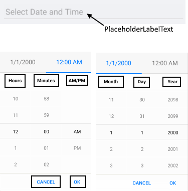

# Date and Time Picker Localization

RadDateTime Picker for Xamarin provides language localization. In short, you can translate the used across the Date and Time Picker texts to other languages, so that your app can be adapted to different regions.

>important To learn in details about the localization process of Telerik UI for Xamarin components, please go through the common [Localization and Globalization]() topic.

The sections below list all the localization keys used in Date and Time Picker Spinners.

## Date and Time Spinners Localization Keys

| Localization Key | Default Value |
| -----------------| ------------- |
| DateTimePicker_AmPmSpinnerHeaderString  | AM/PM |
| DateTimePicker_DaySpinnerHeaderString  | Day |
| DateTimePicker_HourSpinnerHeaderString  | Hours |
| DateTimePicker_MinuteSpinnerHeaderString  | Minutes |
| DateTimePicker_MonthSpinnerHeaderString  | Month |
| DateTimePicker_SecondSpinnerHeaderString  | Seconds |
| DateTimePicker_YearSpinnerHeaderString  | Year |

Check in the image below how the localization strings are presented in Date and Time Picker Spinners:

## Common Picker Localizations strings

| Localization Key | Default Value |
| -----------------| ------------- |
| Pickers_Placeholder  | Pick a value |
| Pickers_Popup_AcceptButtonText  | OK |
| Pickers_Popup_RejectButtonText  | Cancel |

Check in the image below how the common localization strings are presented in Date and Time Picker:

## See Also

* [Localization and Globalization]()
