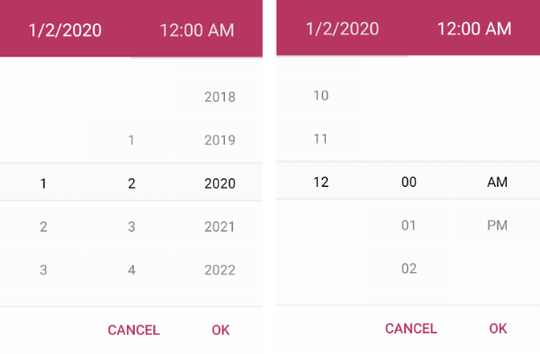

# Overview

**Telerik Date and Time Picker for Xamarin** provides an easy way to pick a date, time or date and time depending on the used format string. Its items are visualized inside a popup. Date and Time Picker control has a number of features which allows you to set a date range, date and time format and fully customize the dialog appearance such as its header and footer.  

## Key features

* **String format**: Date and Time Picker for Xamarin allows you to use standard or custom date and time format strings through the SpinnerFormatString property. Depending on what format is set, the picker visualizes spinner controls with prepopulated values to be picked. This feature allows you to create a date picker, time picker or combination of both. For more information check the [DateTime Format String]() topic in our documentation.

* **Templates**: Date and Time Picker provides templates for its header and footer. Also we have exposed templates for the picker placeholder and display text. For additional info go to [Templates]() article.

* **DisplayString Format**: You can choose what text to display when a date/time was picked through the DateTime Picker DisplayStringFormat property. For more info on this check the [Key Features - DisplayString Format](#displaystring-format) section.

* **Date Range**: RadDateTime Picker allows you to define a particular start and end date and choose a date in between. To learn more about this, visit [Key Features Date Range](#date-range) section.

* **Flexible Styling API**: Take advantage of the styling capabilities of the RadDateTimePicker control. You can easily style its Spinners, the Popup and its header and footer, the text displayed after date/time is picked and many [more]().

* **Commands Support**: DateTime Picker exposes commands that allow you to clear the selected date/time - Clear Command and Toggle Command which allows you to open and close the dialog. More information about Commands support check our help article [here]().

>tip Check out RadDateTime Picker [Getting Started]() help article that shows how to use it in a basic scenario.

## See Also

- [Getting Started]()
- [Key Features]()
- [Templates]()
- [Styling]()