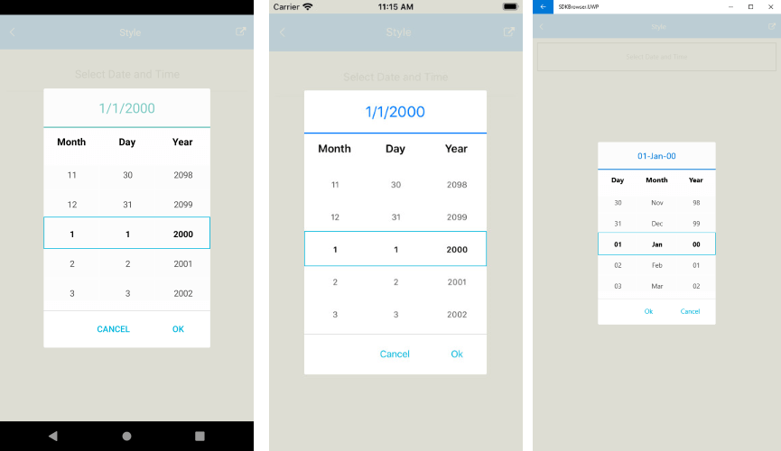

# Styling

Date and Time Picker control for Xamrin provides the following Style properties for customizing its look:

* **SpinnerStyle**(of type *Style* with target type is **telerikDataControls:RadSpinner**): Defines the style applied to the spinner item and selected item.
* **SpinnerHeadersStyle**(of type *Style* with target type is **Label**): Specifies the style applied to the spinner header labels.
* **SelectionHighlightStyle**(of type *Style* with target type is **telerikPrimitives:RadBorder**): Specifies the style applied to the selection inside the popup. 
* **PlaceholderLabelStyle**(of type *Style* with target type is **Label**): Defines the style applied to the placeholder label. 
* **DisplayLabelStyle**(of type *Style* with target type is **Label**): Defines the style applied to the label which is visualized when date/time is selected.
* **TabStripStyle**(*Style*):
* **TabStripItemStyle**(*Style*):
* **SelectorSettings**(*Telerik.XamarinForms.Input.PickerPopupSelectorSettings*):

Using the SelectorSettings property of the RadPickerBase class, you could style the dialog(popup) through the following properties:

* **PopupViewStyle**(of type *Style* with target type is **telerikInput:PickerPopupContentView**): Defines the popup view style.
* **HeaderStyle**(of type *Style* with target type is **telerikInput:PickerPopupHeaderView**): Defines the popup header style.
* **HeaderLabelStyle**(of type *Style* with target type is **Label**): Defines the popup header label style.
* **FooterStyle**(of type *Style* with target type is **telerikInput:PickerPopupFooterView**): Defines the popup footer style.
* **AcceptButtonStyle**(of type *Style* with target type is **Button**): Defines the Accept button style.
* **CancelButtonStyle**(of type *Style* with target type is **Button**): Defines the Cancel button style.

The SelectorSetting also provides the following properties for popup customization:

* **PopupOutsideBackgroundColor**(*Xamarin.Forms.Color*): Defines the color outside of the popup.
* **HeaderLabelText**(*string*): Specifies the text visualized in the popup header.
* **AcceptButtonText**(*string*): Defines the text visualized for the accept button. By default the text is *OK*.
* **CancelButtonText**(*string*): Defines the text visualized for the cancel button. By default the text is *Cancel*. 

## Example

Here is a sample example that shows how the styling properties are applied.

A sample **List Picker** definition:

<snippet id='datetimepicker-style' />

and here are how the styles are defined in the page resources

### SpinnerStyle

<snippet id='datetimepicker-style-spinner-style' />

### SpinnerHeadersStyle

<snippet id='datetimepicker-style-spinner-header-style' />

### SelectionHighlightStyle

<snippet id='datetimepicker-style-selection-highlight-style' />

### PlaceholderLabelStyle

<snippet id='datetimepicker-style-placeholder-label-style' />

### DisplayLabelStyle

<snippet id='datetimepicker-style-display-label-style' />

### PopupViewStyle

<snippet id='datetimepicker-style-popupview-style' />

### HeaderStyle

<snippet id='datetimepicker-style-header-style' />

### HeaderLabelStyle

<snippet id='datetimepicker-style-header-label-style' />

### FooterStyle

<snippet id='datetimepicker-style-footer-style' />

### AcceptButtonStyle

<snippet id='datetimepicker-style-accept-button-style' />

### CancelButtonStyle

<snippet id='datetimepicker-style-cancel-button-style' />

This is how the Date and Time Picker control looks when the styles described above are applied:

>important A sample Styling example can be found in the DateTimePicker/Features folder of the [SDK Samples Browser application]().

## See Also

- [Key Features]()
- [Custom Templates]()
- [Commands]()
- [Visual Structure]()
