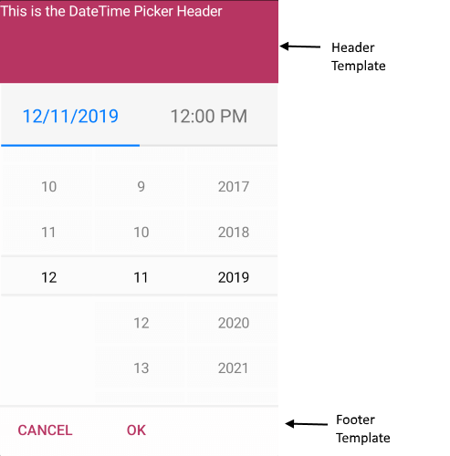

# Templates

If the default templates of the control do not suit your needs, you can easily define a custom template. The available templates for customizing are:

* **PlaceholderTemplate**(*ControlTemplate*): Defines the template visualized for the placeholder.  
* **DisplayTemplate**(*ControlTemplate*): Defines the template visualized when the picked date/time is displayed.
* **HeaderTemplate**(*ControlTemplate*): Defines what will be displayed inside the dialog(popup) header.
* **FooterTemplate**(*ControlTemplate*): Defines what will be displayed inside the dialog(popup) footer.

## Example

The snippet below shows a simple RadDateTimePicker definition:

<snippet id='datetimepicker-custom-templates' />

Now lets add the templates definition to the page resources:

### PlaceholderTemplate

<snippet id='datetimepicker-placeholder-template' />


### DisplayTemplate

<snippet id='datetimepicker-display-template' />


## HeaderTemplate

<snippet id='datetimepicker-header-template' />

## FooterTemplate

<snippet id='datetimepicker-footer-template' />



In addition to this, you need to add the following namespace:

```XAML
xmlns:telerikInput="clr-namespace:Telerik.XamarinForms.Input;assembly=Telerik.XamarinForms.Input"
```

>important A sample Custom Templates example can be found in the DateTimePicker/Features folder of the [SDK Samples Browser application]().

## See Also

- [Suppoted Standard Date and Time Format Strings]()
- [Key Features]()
- [Styling]()