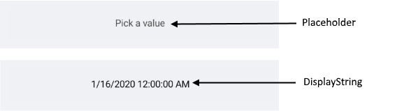
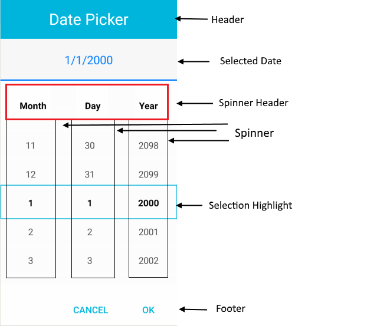

# Visual Structure

Here are described all visual elements used in the Date and Time Picker for Xamarin.

## DateTime Picker Structure before and after a date/time is selected

## Picker Popup Visual Structure

>important More information about Spinners refer to the [RadSpinner help article]().

## Legend ##

- **Placeholder** 
- **DisplayStringFormat** 
- **HeaderLabelText**
- **SelectedDate**
- **SpinnerHeader** 
- **Spinner**
- **SelectionHighlight** 
- **Footer**