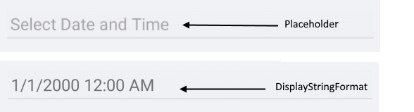

# Visual Structure

Here are described all visual elements used in the Date and Time Picker for Xamarin.

## DateTime Picker Structure before and after a date/time is selected

## Picker Popup Visual Structure

>important More information about Spinners refer to the [RadSpinner help article]().

## Legend ##

- **Placeholder** - the text visualized before picking a date/time. Placeholder could be customized through the [PlaceholderTemplate](#placeholdertemplate) property.
- **DisplayStringFormat** - the text vislualized after a date/time is picked.
- **Header** - the text displayed in the popup header. It could se set a direct text through the [HeaderLabelText](#styling) property or fully customize the popup header using the [HeaderTemplate](#headertemplate) property.
- **SelectedDate** - the date displayed when popup is open.
- **SpinnerHeader** - the text visualized for spinner header depending on the values to be picked. For example if the *SpinnerFormatString* is *d* and *AreSpinnerHeadersVisible="True"* The text visualized for spinner header will be **Month** **Day** **Year**.
- **Spinner** - displays items in a list.
- **SelectionHighlight** - highlisht the current selected date/time when the popup is open.
- **Footer** - the footer of the popup. By default is contains OK and Cancel Buttons. It could be customized through the [FooterTemplate](#footertemplate) property.