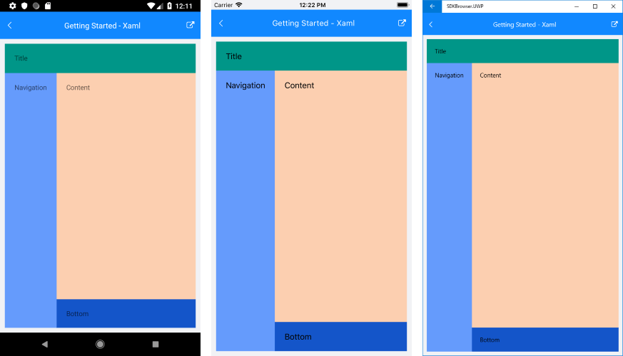

# Getting Started

This article will guide you through the steps needed to add a basic **RadDockLayout** control in your application.

* [Setting up the app](#1-setting-up-the-app)
* [Adding the required Telerik references](#2-adding-the-required-telerik-references)
* [Adding RadDockLayout control](#3-adding-raddocklayout-control)

## 1. Setting up the app

Take a look at these articles and follow the instructions to setup your app:

- [Setup app with Telerik UI for Xamarin on Windows]()
- [Setup app with Telerik UI for Xamarin on Mac]()

## 2. Adding the required Telerik references

You have two options:

* Add the Telerik UI for Xamarin Nuget package following the instructions in [Telerik NuGet package server]() topic.

If you don't want to add the all Telerik.UI.for.Xamarin nuget package, you have the option to add a separate nuget package. For RadDockLayout control you have to install the **Telerik.UI.for.Xamarin.Common** nuget package.

* Add the references to Telerik assemblies manually, check the list below with the required assemblies for **RadDockLayout** component:

| Platform | Assemblies |
| -------- | ---------- |
| Portable | Telerik.XamarinForms.Common.dll |
| Android  | Telerik.Xamarin.Android.Common.dll Telerik.XamarinForms.Common.dll |
| iOS      | Telerik.Xamarin.iOS.dll  Telerik.XamarinForms.Common.dll |
| UWP      | Telerik.XamarinForms.Common.dll |

## 3. Adding RadDockLayout control

You could use one of the following approaches:

#### Drag the control from the Toolbox. 

Take a look at the following topics on how to use the toolbox:

* [Telerik UI for Xamarin Toolbox on Windows]()
* [Telerik UI for Xamarin Toolbox on Mac]()
	
#### Create the control definition in XAML or C#.

The snippet below shows a simple RadDockLayout definition:

<snippet id='docklayout-getting-started-xaml' />
<snippet id='docklayout-getting-started-csharp' />

In addition to this, you need to add the following namespace:

<snippet id='xmlns-telericommon' />
<snippet id='ns-telerikcommon' />

This is the result:

>important **SDK Browser** and **QSF** applications contain different examples that show RadDockLayout's main features. You can find the applications in the **Examples** and **QSF** folders of your local **Telerik UI for Xamarin** installation.

## See Also

- [Key Features]()