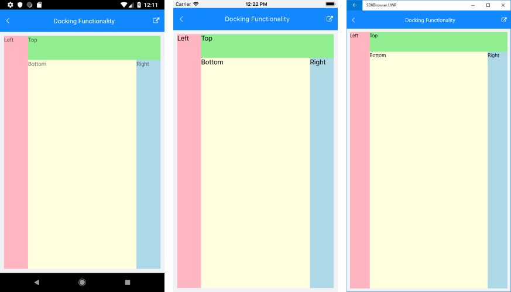
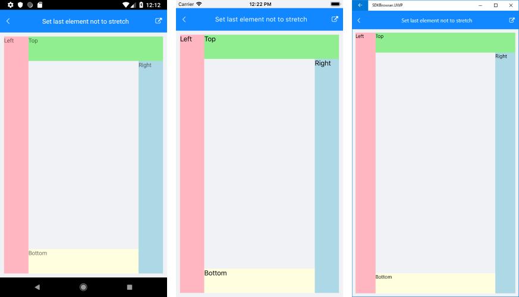
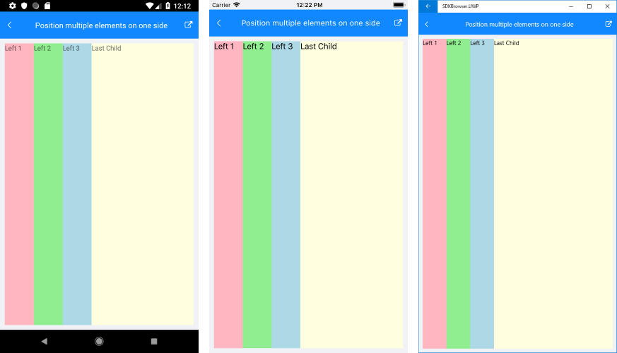

# Key Features

The purpose of this help article is to show you the key features of the **RadDockLayout** control. 

## Docking functionality

To define the docking side of a child element inside the dock layout component, use **RadDockLayout.Dock** attached property which receives any of the following values:

* Left
* Top
* Right
* Bottom

The way the child elements are docked and arranged depends on their order inside the DockLayout’s Children collection (the order they’re defined in XAML).

Following is a quick example on how you could utilize the docking functionality:

<snippet id='docklayout-docking-feature' />

Check the result on different platforms below:

## Position a child element inside the remaining area of the layout

By default, the last element inside the DockLayout stretches along the remaining space not occupied by the other child elements. You can prevent this behavior by setting **StretchLastChild** property of the DockLayout control to *False*. Check the example below how it would work when set to *False*:

<snippet id='docklayout-position-lastelement'/>

And here is how it looks:

## Position multiple elements on one side

Setting the same docking side to a few child elements will arrange them according to their order inside the DockLayout’s Children collection.  

<snippet id='docklayout-position-elementsoneside'/>

And the result is:

## See Also

- [Getting Started]()
