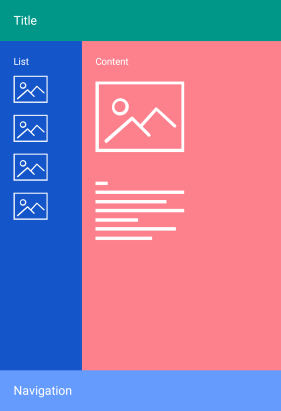

# Overview #

**Telerik RadDockLayout for Xamarin** is a layout that provides a mechanism for child elements to be docked to the left, right, top or bottom edge or to occupy the center area of the layout. 

#### Figure 1: RadDockLayout Overview

## Key features

* **Docking functionality**: You could easily set the position of each child element inside the layout through *RadDockLayout.Dock* attached property. For more details on this check [here](#docking-functionality).
* **Positioning a child element inside the remaining area of the layout**: By default, the last element inside the DockLayout stretches along the remaining space not occupied by the other child elements. You can prevent this behavior by applying *StretchLastChild* property of the DockLayout control. Go [here](#position-a-child-element-inside-the-remaining-area-of-the-layout) for more information regarding this.

## See Also

- [Getting Started]()