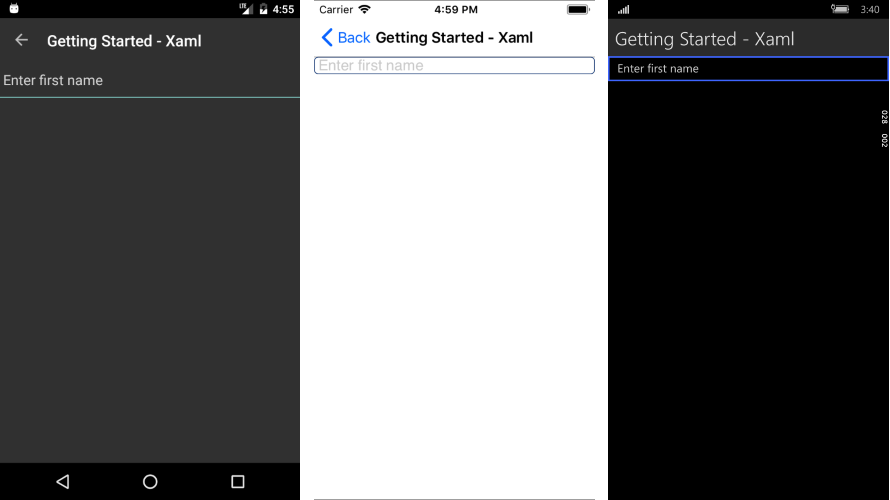

# Getting Started
   
This article will guide you through the steps needed to add a basic **RadEntry** control in your application.

* [Setting up the app](#1-setting-up-the-app)
* [Adding the required Telerik references](#2-adding-the-required-telerik-references)
* [Adding RadAutoCompleteView control](#3-adding-radentry-control)

## 1. Setting up the app

Take a look at these articles and follow the instructions to setup your app:

- [Setup app with Telerik UI for Xamarin on Windows]()
- [Setup app with Telerik UI for Xamarin on Mac]()

## 2. Adding the required Telerik references

You have two options:

* Add the Telerik UI for Xamarin Nuget packages following the instructions in [Telerik NuGet package server]() topic.

* Add the references to Telerik assemblies manually, check the list below with the required assemblies for **RadEntry** component:

| Platform | Assemblies |
| -------- | ---------- |
| Portable | Telerik.XamarinForms.Common.dll<br/>Telerik.XamarinForms.Input.dll |
| Android  | Telerik.Xamarin.Android.Common.dll <br/>Telerik.Xamarin.Android.Data.dll <br/>Telerik.Xamarin.Android.Input.dll <br/>Telerik.Xamarin.Android.List.dll <br/> Telerik.Xamarin.Android.Primitives.dll <br/>Telerik.XamarinForms.Common.dll <br/>Telerik.XamarinForms.Input.dll |
| iOS      | Telerik.Xamarin.iOS.dll <br/>Telerik.XamarinForms.Common.dll <br/>Telerik.XamarinForms.Input.dll |
| UWP      | Telerik.Core.dll <br/>Telerik.Data.dll <br/>Telerik.UI.Xaml.Controls.Data.UWP.dll <br/> Telerik.UI.Xaml.Input.UWP.dll <br/>Telerik.UI.Xaml.Primitives.UWP.dll <br/>Telerik.XamarinForms.Common.dll <br/>Telerik.XamarinForms.Input.dll <br/>|


## 3. Adding RadEntry control

You could use one of the following approaches:

#### Drag the control from the Toolbox. 

Take a look at the following topics on how to use the toolbox:

* [Telerik UI for Xamarin Toolbox on Windows]()
* [Telerik UI for Xamarin Toolbox on Mac]()
	
#### Create the control definition in XAML or C#.

The snippet below shows a simple RadEntry definition:

<snippet id='entry-getting-started-xaml'/>
```C#
var entry = new RadEntry();
```

In addition to this you need to add the following namespace:

<snippet id='xmlns-telerikinput'/>
<snippet id='ns-telerikinput'/>

Here is the result:



>important The **SDK Browser** and **QSF** applications contain different examples that show RadEntry's main features. You can find the applications in the **Examples** and **QSF** folders of your local **Telerik UI for Xamarin** installation.

## See Also

- [Key Features]()
- [Events]()
- [Theming and Style]()
