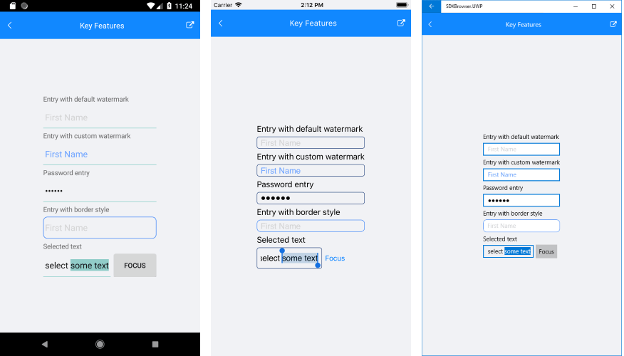

# Key Features

The purpose of this help article is to show you the key features of the **RadEntry** control. 

## Text

The following properties are related to the Entry Text appearance and alignment:

* **Text**(*string*): Defines the Text;
* **TextColor**(*Color*): Defines the color of the visible text of the RadEntry control.
* **VerticalTextAlignment**(*of type Xamarin.Forms.Textalignment*): Specifies the vertical alignment of the RadEntry.Text;
* **HorizontalTextAlignment**(*of type Xamarin.Forms.Textalignment*): Specifies the horizontal alignment of the RadEntry.Text;
* **Padding**(*Thickness*): Defines the Padding of the text;

## Watermark 

RadEntry exposes **WatermarkText**(*string*) property used to give guidance to the end user on what should be entered in the text input. The watermark text is displayed when the control is empty.  Additionally, you could set **WatermarkTextColor**(*Color*) to customize the look of the watermark text. 

<snippet id='entry-features-customwatermark'/>

Where:

<snippet id='xmlns-telerikinput'/>

## Password

RadEntry provides **IsPassword**(*bool*) property, which when set to True, replaces the input with password hint character.

<snippet id='entry-features-password'/>

## Keyboard

The **Keyboard** property of type *Xamarin.Forms.Keyboard* allows you to define the type of the keyboard that will be visualized by the device.

```XAML
<telerikInput:RadEntry x:Name="entry" 
                       Keyboard="Numeric"
                       WatermarkText="Watermark Text" />
```

## Text Selection

The following properties are related to the Entry text selection: 

* **CursorPosition**(*int*) Specifies the starting position of the text selected in the entry.
* **SelectionLength**(*int*) Specifies the number of characters in the current selection in the entry control.

The next snippet shows how both could be applied in order to preselect part of the Text of the Entry when the control receives the focus:

<snippet id='entry-features-textselection' />

And the Clicked event handler:

<snippet id='entry-features-textselection-code' />

Here is the end result:



## Font Options:

RadEntry control has the following properties for defining the Font Options:

* **FontAttributes**
* **FontFamily**
* **FontSize**

<snippet id='entry-font-options-xaml' />

>important You can find a working demo labeled **Key Features** in the Entry/Features folder of the [SDK Samples Browser application]().

>tip For a full list of the provided properties of RadEntry, check its API reference here: [RadEntry Properties](https://docs.telerik.com/devtools/xamarin/api/Telerik.XamarinForms.Input.RadEntry.html#properties).

## See Also

- [Events]()
- [Theming and Style]()
- [Getting Started]()
