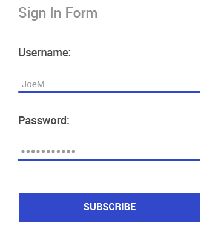

# Overview

**RadEntry** is a text input control, which accepts string input from the users and provides consistent look and feel with the rest of the Telerik UI for Xamarin components through innovative theming mechanism.

#### Figure 1: RadEntry Overview

## Key features

 * **Watermark**: RadEntry allows setting a placeholder text in the control, which could hint the users what is the input that is expected. For more details read [here](#watermark).
 * **Password functionality**: You could hide the characters a user is typing for privacy reasons, check [here](#password) for more details.
 * **Border styles**: RadEntry gives you the option to customize the look of the border around the input using the BorderStyle property, for more details read [here](#borderstyle).
 * **Keyboard support**: You could specify the virtual keyboard to be used with RadEntry considering the expected input.

## See Also

- [Getting Started]()
- [Key Features]()
- [Events]()
