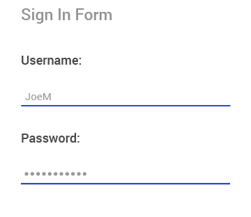

# Overview

**RadEntry** is a text input control, which accepts string input from the users and provides consistent look and feel with the rest of the Telerik UI for Xamarin components through innovative theming mechanism.

#### Figure 1: RadEntry Overview

## Key features

 * **Watermark**: RadEntry allows setting a placeholder text in the control, which could hint the users what is the input that is expected. For more details read [here](#watermark).
 * **Password functionality**: You could hide the characters a user is typing for privacy reasons, check [here](#password) for more details.
 * **Keyboard support**: You could specify the virtual keyboard to be used with RadEntry considering the expected input.
 * **Non-Editable(Read-Only) state**: Using a single property - `IsReadOnly`, you can specify whether the RadEntry control can be edited or not. Example and explanation can be found in [Key Features - Read-Only State](#non-editable-state).
 * You can define the **maximum number of symbols** allowed in the RadEntry control. For detailed explanation and example check the [Key Features - Max Length](#max-length) section.
 * **Border styles**: RadEntry gives you the option to customize the look of the border around the input using the BorderStyle property, for more details read [here](#borderstyle).

## See Also

- [Getting Started]()
- [Key Features]()
- [Events]()
