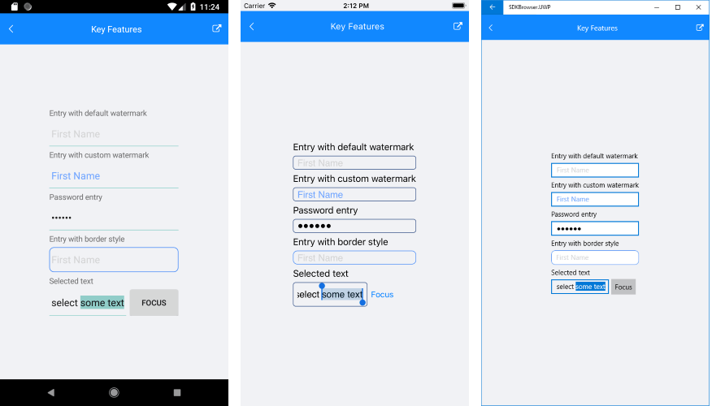

# Key Features

The purpose of this help article is to show you the key features of the **RadEntry** control. 

## Watermark

RadEntry exposes **WatermarkText** property used to give guidance to the end user on what should be entered in the text input. The watermark text is displayed when the control is empty.  Additionally, you could set **WatermarkTextColor** to customize the look of the watermark text. 

<snippet id='entry-features-customwatermark'/>

Where:

<snippet id='xmlns-telerikinput'/>

## Password

RadEntry provides **IsPassword** Boolean property, which when set to True, replaces the input with password hint character.

<snippet id='entry-features-password'/>

## BorderStyle

**BorderStyle** property allows you to customize the border around the Entry through the following properties: BorderColor, BorderThickness and CornerRadius. The default value is defined by the OS.

You could define the **BorderStyle** in the Resources of your page as shown in the example below:

<snippet id='entry-features-borderstyledefinition'/>

And then apply that Style to the Entry instance:

<snippet id='entry-features-borderstyle'/>

Here is the end result:

## See Also

- [Entry Getting Started]()
