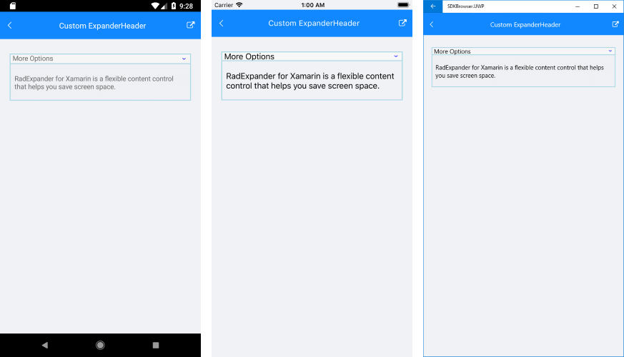

# ExpanderHeader control

**ExpanderHeader** represents the Header of the Expander control which is used to show or hide the expandable container. ExpanderHeader provides a customizable Indicator to mark the current state of the Expander as well as BorderColor and BorderThickness properties to style the Header per your needs.

## Indicator Options

The indicator is the little triangle that is rotated according to whether the Expander control is expanded or collapsed. ExpanderHeader provides various options for customizing the look of the indicator via the following properties:

* **IndicatorText**: The indicator is represented by a string symbol that could be changed through IndicatorText property;
* **IndicatorFontFamily**: Specifies the indicator text FontFamily;
* **IndicatorFontSize**: Defines the indicator text font size;
* **IndicatorColor**: This property sets the color of the indicator;
* **IndicatorLocation**: This property is of type *ExpandCollapseIndicatorLocation* and is used to place the indicator to the left or to the right inside the Header;
* **IndicatorAnimationDuration**: Specifies the duration of the rotation animation of the indicator;
* **IndicatorAnimationEasing**: Specifies the easing of the rotation animation of the indicator;
* **IndicatorMargin**: This property is of type *Thickness* and sets the margin applied to the indicator;

## Border Styling

You could apply **BorderColor** and **BorderThickness** properties of HeaderExpander to make it consistent with the design of your app. 

## Example

Check the example below on how the Indicator options and border properties could be applied:

<snippet id='expander-features-expanderheader'/>

## See Also

- [Key Features]()
