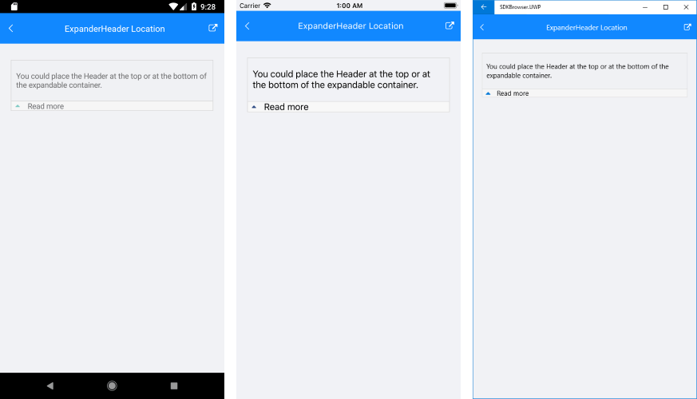

# Key Features

The purpose of this help article is to show you the key features of the **RadExpander** control. 

## Collapsed/expanded States

RadExpander provides an expandable container which can host any content. You can show or hide this content by interacting with the **Header** of the control. The default state of RadExpander is collapsed.

You could use **IsExpanded** Boolean property to switch the current state of the control.

## Expander Header

You could either apply **HeaderText** property or use the **ExpanderHeader** content control which provides a set of useful properties for customizing the way the header looks. For more details refer to [ExpanderHeader control]() topic.

Additionally, you could place the Header at the top or at the bottom of the expandable container through **HeaderLocation** property of type *ExpanderHeaderLocation*. The next snippet shows how the HeaderLocation could be set to “Bottom”:

<snippet id='expander-features-headerlocation'/>

And here is how it looks:

## Animation while expanding/collapsing

To enable or disable the animation you need to use the **IsAnimationEnabled** property of RadExpander. By default, the Animation is enabled.

You could also customize the duration and easing (acceleration over time) through **AnimationDuration**(in ms) and **AnimationEasing** (of type *Xamarin.Forms.Easing*) properties.

## Border Styling

You could apply **BorderColor** and **BorderThickness** properties of RadExpander to make it consistent with the design of your app.

>note ExpanderHeader also provides means for customizing its border, you can learn more about this in the [ExpanderHeader: Border Styling](#border-styling) article.

Check the example below on how the border settings could be defined:

<snippet id='expander-features-borderstyling'/>

And the result is:

## See Also

- [Getting Started]()
