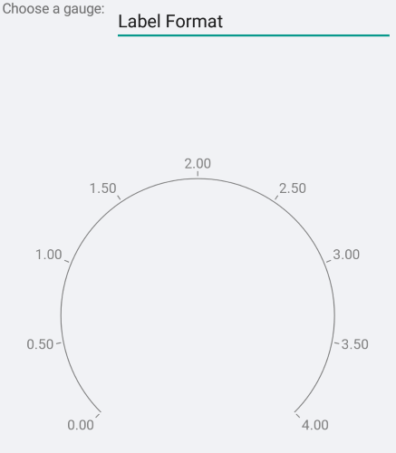

# Gauge Axis

The axis is a gauge element that is used to control everything related to the display of the axis. This includes ticks, labels, appearance and axis range. 

## Examples

### Axis Range

Presently, the axis does not have an auto-range mechanism so it is mandatory that you set **Minimum**, **Maximum** and **Step**.

<snippet id='gauge-axis-range'/>


## Appearance

You can control the stroke of the axis line and ticks via the **Stroke** property. If you need to have a different color for the ticks you need to set the **TickStroke** property. Similarly, setting the **StrokeThickness** affects both the axis line and ticks. If you need ticks with a different stroke thickness you need to set the **TickThickness** property.

<snippet id='gauge-axis-appearance'/>


## Font Style

You can control the appearance of the labels via the **FontSize**, **FontFamily** and **FontAttributes** properties.

<snippet id='gauge-axis-font-style'/>


## FontFamily

Note that the **FontFamily** property is of type string and you need to pass the name of the font family. Remember that the different platforms work with different fonts so you may need to use the **OnPlatform** method.

<snippet id='gauge-axis-font-family'/>


## Label Format

You can control the numeric format of the content of the labels. The default label format is "G7".

<snippet id='gauge-axis-label-format'/>



## Label And Tick Position

In the radial gauge, the gauge elements can be positioned on the inside or on the outside of the axis line. Some of the elements, such as the ticks, can also be centered on the axis line. This is controled by the Position property of the concrete element.

<snippet id='gauge-axis-label-and-tick-position'/>


## Offset And Length

The distance between the concrete element and the axis line is defined by an offset property (**Offset**, **TickOffset**, **LabelOffset**). You can also specify the length of the ticks.

<snippet id='gauge-axis-offset-and-length'/>


## Label Visibility

You can change axis label visibility by setting the `ShowLabels = "False"`. The default value is `True`. 

```XAML
<telerikGauges:GaugeLinearAxis ShowLabels="False"
							   Maximum="250"
                               Minimum="0"
                               Step="25" />
```

The following image shows the end result.


## Tick Thickness

Change the thickness of the axis ticks using the `TickThickness` property. 

If you want to completely remove the ticks set `TickThickness="0"`.

```XAML
<telerikGauges:GaugeLinearAxis Maximum="250"
                               Minimum="0"
                               Step="25" 
							   TickThickness="0" />
```

The following image shows the end result.


In scenario when Labels are hidden and the tick thickness is set to 0:

```XAML
<telerikGauges:GaugeLinearAxis Maximum="250"
                               Minimum="0"
                               Step="25" 
							   TickThickness="0" 
							   ShowLabels="False" />
```


>important A sample Gauge Axis Customization example can be found in the Gauge/Customizations folder of the [SDK Samples Browser application]().

## See Also

- [Indicators]()
- [Positioning]()
- [Ranges]()
