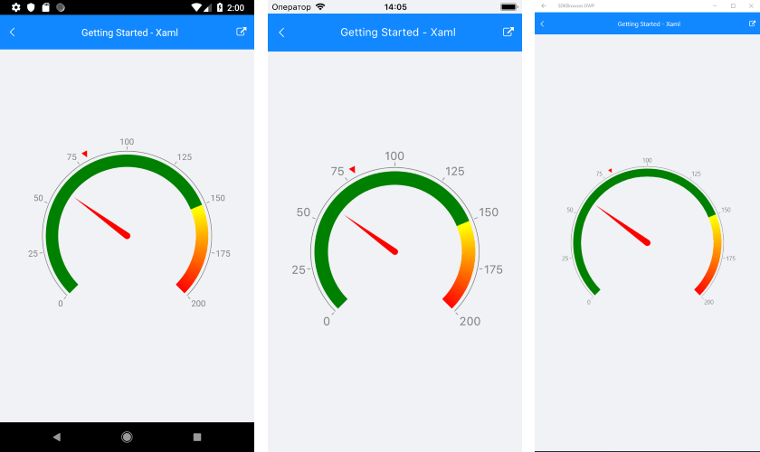

# Getting Started

This article will guide you through the steps needed to add a basic **RadGauge** control in your application.

* [Setting up the app](#1-setting-up-the-app)
* [Adding the required Telerik references](#2-adding-the-required-telerik-references)
* [Adding RadGauge control](#3-adding-radgauge-control)
* [Gauge types](#4-gauge-types)

## 1. Setting up the app

Take a look at these articles and follow the instructions to setup your app:

- [Setup app with Telerik UI for Xamarin on Windows]()
- [Setup app with Telerik UI for Xamarin on Mac]()

## 2. Adding the required Telerik references

You have two options:

* Add the Telerik UI for Xamarin Nuget packages following the instructions in [Telerik NuGet package server]() topic.

* Add the references to Telerik assemblies manually, check the list below with the required assemblies for **RadGauge** component:

| Platform | Assemblies |
| -------- | ---------- |
| Portable | Telerik.XamarinForms.Common.dll   Telerik.XamarinForms.DataVisualization.dll   Telerik.XamarinForms.SkiaSharp.dll |
| Android  | Telerik.Xamarin.Android.Common.dll   Telerik.XamarinForms.Common.dll   Telerik.XamarinForms.DataVisualization.dll   Telerik.XamarinForms.SkiaSharp.dll |
| iOS      | Telerik.XamarinForms.Common.dll   Telerik.XamarinForms.DataVisualization.dll   Telerik.XamarinForms.SkiaSharp.dll |
| UWP      | Telerik.XamarinForms.Common.dll   Telerik.XamarinForms.DataVisualization.dll   Telerik.XamarinForms.SkiaSharp.dll |

## 3. Adding RadGauge control

You could use one of the following approaches:

#### Drag the control from the Toolbox. 

Take a look at the following topics on how to use the toolbox:

* [Telerik UI for Xamarin Toolbox on Windows]()
* [Telerik UI for Xamarin Toolbox on Mac]()
	
#### Create the control definition in XAML or C#.

The snippet below shows a simple RadGauge definition:

<snippet id='gauge-getting-started-xaml'/>
<snippet id='gauge-getting-started-csharp'/>

In addition to this, you need to add the following namespace:

<snippet id='xmlns-telerikgauges'/>
<snippet id='ns-telerikgauges'/>

This is the result:
 

> You can follow this tutorial to set up also the RadVerticalGauge and RadHorizontalGauge controls which expose the same API.

### Gauge types

There are 2 gauge types that you can use to display different layout - radial and linear (horizontal and vertical). You can read more about these types at the listed articled below:

- [Radial Gauge]()
- [Horizontal Gauge]()
- [Vertical Gauge]()

>important **SDK Browser** and **QSF** applications contain different examples that show Gauges' main features. You can find the applications in the **Examples** and **QSF** folders of your local **Telerik UI for Xamarin** installation.

### See Also

- [Axis]()
- [Indicators]()
- [Ranges]()
