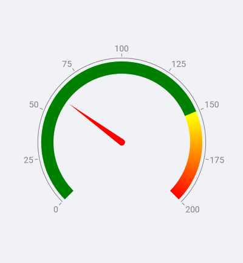
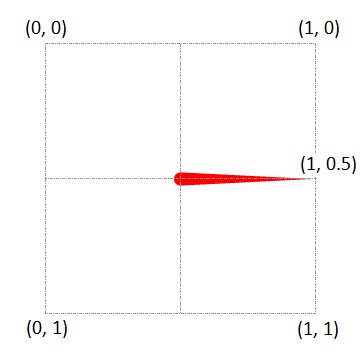
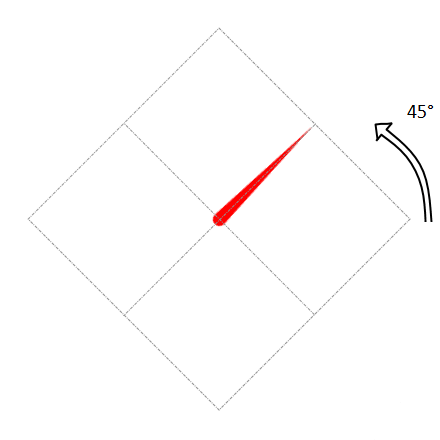
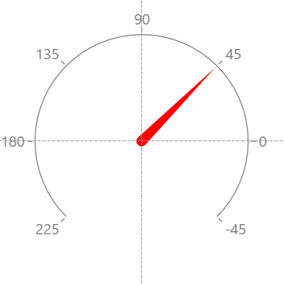
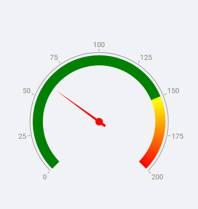
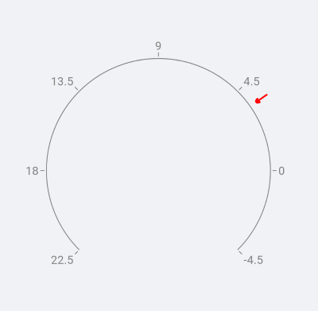

# Indicators

The gauge indicators are elements that display data related values in a different manner.

## Needle Indicator

The **GaugeNeedleIndicator** is part of the radial gauge. It presents a single value set by the **Value** property. The needle is intended to visually liken an actual gauge needle. The center of rotation of the needle coincides with the center of the gauge and is directed towards where the value on the gauge axis is. How far the tip of the needle gets is determined by its **Position** and **Offset** properties.

### Custom Needle Indicator

You can use a custom shape for the needle by taking advantage of the **Shape** property. In order to achieve the desired output you need to set up the geometry that describes the needle you want. The gauge expects that these conditions are met when a shape geometry is set:

>- The coordinates are relative values between 0 and 1.
>- The rotation pivot point is (0.5, 0.5).
>- The needle's orientation is from (0.5, 0.5) to (1, 0.5).

When the gauge draws the needle, the geometry is scaled to the size it will be displayed with. This size is a result of the diameter of the axis arc, the needle's position and offset. It is then rotated so that the needle points at the value. In the example below, the angle of rotation is 45 and in this case coincides with the needle's value.

Here is an example of a custom needle shape:

<snippet id='gauge-custom-needle-shape'/>

>important A sample Custom Needels example can be found in the Gauge/Customizations folder of the [SDK Samples Browser application]().

## Shape Indicator

The **GaugeShapeIndicator** has the following properties:

* **Value**: Defines a single value of the shape indicator. 
* **Size**: Defines the size of the shape indicator. 

The shape indicator is essentially a square box and is drawn so that its center coincides with the point defined by the Position and Offset properties. The shape is rotated around its center so that the default arrow shape always points towards the axis line. 

### Custom Shape Indicator

You can use a custom shape for the **GaugeShapeIndicator** by taking advantage of the **Shape** property. In order to achieve the desired output, you need to understand how to set up the geometry that describes the shape you want. The gauge expects that these conditions are met when a shape geometry is set:

>- The coordinates are in relative values between 0 and 1.
>- The rotation pivot point is (0.5, 0.5).
>- The shape's orientation is from (1, 0.5) to (0.5, 0.5).

When the gauge draws the shape, the geometry is scaled to the size it will be displayed with. Then it is moved to the point defined by the Position and Offset properties. It is then rotated so that the shape points at the axis line. In the example below, the indicator's value is 3.5 and the angle of rotation is 35 degrees.

Here is an example of a custom shape:

<snippet id='gauge-custom-shape'/>

>important A sample Custom Shapes example can be found in the Gauge/Customizations folder of the [SDK Samples Browser application]().

## Bar Indicator

The **GaugeBarIndicator** presents a single value set by the **Value** property. The bar indicator is drawn alongside the axis line (parallel to it) and is drawn from the axis origin value. 

<snippet id='gauge-bar-indicator'/>

### Range Bar Indicator

The **GaugeBarIndicator** presents a value range set by the **From** and **To** properties. 

<snippet id='gauge-range-bar-indicator'/>

>important You could find example with Gauge Bar Indicators inside the Gauge/Features folder of the [SDK Samples Browser application]().

## Text Indicator

The **GaugeTextIndicator** gives you the possibility to present a text on a specific value. 

<snippet id='gauge-text-indicator'/>

>important You could find example with Gauge Text Indicators inside the Gauge/Features folder of the [SDK Samples Browser application]().

## See Also

- [Positioning]()
- [Ranges]()
