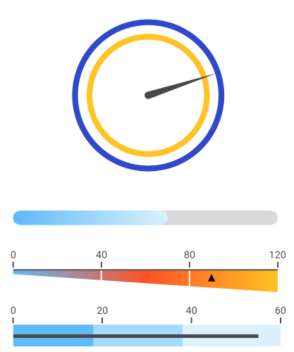

# Overview

The **RadGauge** controls serve as instruments that indicate and give a visual display of amount, level, or contents of something. These values are presented via indicators (needles, arrows, and others). To give context to the indicated value (or values) the gauge uses an axis and gauge ranges. The axis states a minimum and maximum which determine the allowed values. The gauge ranges denote certain parts of the axis range and are usually displayed with different colors to provide additional information. For example, in an axis range [0, 200] a Red gauge range [180, 200] can be added to articulate that values within this range are too high. 

> The gauge controls are available for the following platforms:
> 
> - **Android**
> - **iOS**
> - **Universal Windows Platform**

#### Figure 1: RadGauge Overview

 

## Key features

* **Different display layouts**: RadGauge is the code-name behind the RadRadialGauge, RadHorizontalGauge and RadVerticalGauge controls. They give you the ability to display the gauge scale using different layouts. Read more about the controls in the [Gauge Types]() help section.
* **Linear axis**: Linear scale distribution. Read more about the gauge's axis in the [Axis]() article.
* **Indicators**: Built-in indicators (Arrow, Needle) that allow customization of the appearance, including fill, stroke and shape. Read more about this in the [Indicators]() article.
* **Ranges**: A collection of ranges that allows you to mark different parts of the scale. Read more about this in the [Ranges]() article.
* **Animations**: Smooth out of the box animations. Read more about this in the [Animations]() article.

## See Also
- [Getting Started]()